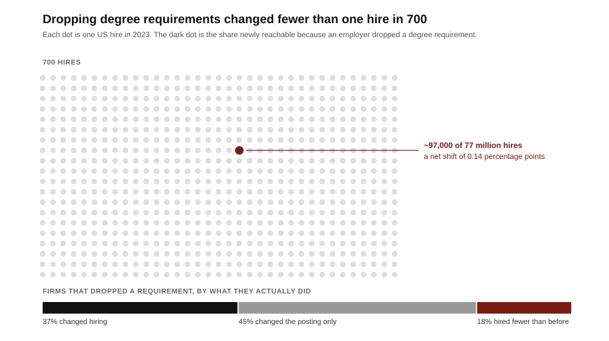

# The bachelor’s degree sells licensure, not learning, which is why a million competing badges have not moved it

**Founder audience: builders of education, hiring, and credentialing products. In 1215 the papal legate Robert de Courçon fixed the Paris arts course at six years and set twenty as the minimum age for the *licentia docendi*, the licence to teach. The rank below that licence was the *baccalarius*, a word taken from the guilds, where *bachelier* named an apprentice, and the Paris bachelor’s obligation was to teach the students beneath him while he waited for the licence above him. The university was not selling lectures; masters taught outside it, for money. It was selling a position on a licensing ladder, with a labour obligation attached. That is still the product. It is also why a decade of credential innovation that rebuilt the teaching at enormous scale and a fraction of the price moved the American hiring filter by fewer than one hire in seven hundred.**

## The position in five facts

- **The first degree was a guild rank, not a course of study.** Paris organized as a *universitas magistrorum*, a guild of masters; Bologna organized as a *universitas scholarium*, a guild of students who hired and paid their teachers. Both used the same ladder — bachelor, licentiate, master — but it was the master-owned Paris model that became the template for northern Europe and, through it, the modern university.[^1][^2]
- **The premium is real and coarse.** In 2024, US full-time workers aged 25 and over whose highest credential was a bachelor’s earned a median $31,200 (62%) more than high school graduates. But a quarter of male four-year graduates earned under $62,300 and a quarter earned over $144,500. The spread inside the credential is roughly triple the gap it certifies.[^3]
- **Supply of alternatives exploded; the filter did not move.** The United States now offers 1,850,034 unique credentials from more than 134,000 providers — 1,022,028 badges against 264,099 degrees — against $2.34 trillion in annual education and workforce spending. Over the same period, Burning Glass Institute and Harvard Business School found that of 11,300 large-firm roles, only 3.6% dropped a degree requirement, producing a net 0.14-percentage-point increase in non-degreed hiring: about 97,000 workers out of 77 million annual hires.[^4][^5]
- **Where firms genuinely dropped the filter, the filter turned out to be negatively informative.** At the 37% of firms driving nearly all the change, workers hired without degrees into formerly degree-gated roles retained 10 percentage points better than their degreed colleagues and took a 25% average pay increase. Roughly 45% of firms changed the posting and nothing else; about a fifth ended up hiring a *smaller* share of non-degreed workers than before.[^5]
- **The rung the degree sold is being removed from under it.** As of August 2026, employment of 22-to-25-year-olds in highly AI-exposed occupations sits about 19% below where it would be had it tracked their less-exposed peers, and the adjustment runs through reduced hiring rather than layoffs. The degree’s core promise is access to a first job in a profession. That is the specific transaction failing.[^6]

## Paris sold admission to practice; the lectures were free

Read the 1215 statutes as a term sheet. They fix the length of study, the books, and the conditions for the licence to teach — a licence, not a transcript.[^1][^2] Below it sat the bachelor, who had passed responsions and the *examen baccalariandorum*, had determined in public disputation, and was thereby cleared to teach juniors as preparation for the mastership.[^2] So the medieval degree bundled three things a modern founder should separate: an assessment, a labour contract, and an option on licensure.

The assessment was the cheapest component and the easiest to copy. The labour contract was valuable to the guild, not the student. The option on licensure was the entire asset, because the same body that examined you also controlled who could practise. Robert de Sorbon’s 1257 college — housing, meals and a library endowed for sixteen poor theology students — is the tell: teaching and lodging were a charitable cost centre bolted onto a licence that the university itself never had to subsidize.[^1]

Bologna ran the counterfactual. There the students formed the guild, hired masters, set fees and enforced attendance.[^1] It is the buyer-owned marketplace, and it is not the model the modern university inherited. Every durable credential since is seller-owned, because a credential is only worth what the issuer can withhold, and buyers who own the issuer cannot credibly withhold anything from themselves. If your credentialing product lets learners set the bar, you have built Bologna.

## The buyer is not the learner

The learner pays with tuition, time and forgone wages. The signal is consumed by someone else: an employer, a graduate committee, a licensing board, a visa officer. That split is the whole market structure, and it explains the apparent irrationality of the last decade.

A hiring manager using a degree filter is not estimating skill. They are minimizing the cost of a defensible mistake across many candidates under time pressure. On that objective a coarse filter with a known failure rate beats a precise filter nobody else recognizes, because the coarse filter is legible to peers, to legal, and to whoever reviews the hire afterwards. This is why accuracy arguments do not move filters, and why the Burning Glass retention finding — non-degreed hires outperforming on retention by 10 points — changed almost nothing.[^5] Being right is not the product. Being uncontroversial is.

The corollary for founders is unpleasant but clarifying: **you cannot sell a credential to the person who wears it.** The learner will pay, but the learner cannot make it valuable. Value comes only from the consumer of the signal changing behaviour, and that consumer switches in cohorts, not individually.

## Two challengers, two strategies, one that worked

**Western Governors University joined the guild first and built the school second.** Founded in 1997 by 19 US governors, its founding act was regional accreditation — at one point holding it from four regional commissions simultaneously — which is what gives it the right to confer degrees.[^7] Only then did it attack the format: competency-based progression, flat tuition per six-month term, credit for demonstrated mastery rather than seat time. In 2024–25 it enrolled 210,208 students, 155,088 of them undergraduates.[^8] That is a top-five-scale American university, built on unbundling *duration* while leaving *licensure* completely intact. WGU proved the four-year package is not the product. It did not test whether the degree is.

**Google Career Certificates built the school and rented back a twelfth of the guild card.** The programme is credible: seven tracks, $49 a month, a 150-plus company employer consortium, and a Google-reported 70%-plus of graduates citing a positive career outcome within six months.[^9] It is also, by the American Council on Education’s recommendation, worth up to 15 college credits — five courses at bachelor’s level, roughly an eighth of a 120-credit degree.[^9] After a decade, millions of enrolments and one of the strongest brands on earth on the certificate, the maximum convertibility into the incumbent credential is about 12%. That is not a failure of instruction. It is the price of not being an accreditor.

The pair is the whole lesson. The organization that bought the licence and changed the pedagogy now educates a fifth of a million people. The organization that changed the pedagogy and skipped the licence has to negotiate for credit, one institution at a time.

## The 2024 natural experiment: announcements are not hiring

Between 2022 and 2024 the removal of degree requirements became a public commitment: Maryland went first among states in 2022, at least twenty followed, and large employers announced in sequence. In Maryland, the share of state postings without a degree requirement moved from 32% to 47%.[^10] That is a real change to the advertisement.

Then the hiring was measured. Using career histories for 65 million US workers, Burning Glass Institute and HBS’s Project on Managing the Future of Work isolated 11,300 employer-occupation roles with observable hiring before and after a requirement was dropped. Within roles that actually dropped it, the share of non-degreed hires rose 3.5 points. But only 3.6% of roles dropped it, so the economy-wide effect was 0.14 points.[^5]

*Each stage is real and each is small. The gap between the first bar and the last is the difference between changing a job posting and changing a filter. Figures are 2023 US hires as estimated by the Burning Glass Institute and Harvard Business School, February 2024.*

For a founder, the diagnostic value is in the segmentation, not the headline. Firms split three ways: 37% leaders who changed practice, about 45% who changed language only, and about a fifth who backslid below their starting point.[^5] A credential product sold on the promise of skills-based hiring is therefore addressing a market roughly a third the size of the one that publicly announced itself, and the buyer inside that third is identifiable in advance: it is a firm that already rebuilt its interview loop, not one that issued a press release.

## What 2026 changes

The degree has always been priced against a specific transaction: it converts a young person with no work record into an employable novice. That conversion is currently failing for reasons unrelated to credentials. Entry-level employment in AI-exposed occupations is running roughly 19% below its counterfactual for 22-to-25-year-olds, driven by firms hiring fewer juniors rather than cutting existing staff.[^6]

Two consequences follow, and they point in opposite directions. The degree becomes *less* effective — it no longer reliably delivers the first job — while becoming *harder* to compete with, because when employers hire fewer juniors they screen harder, and hard screening favours the most legible filter available. Expect the next few years to look like rising dissatisfaction with the degree alongside rising insistence on it. Any credential thesis that assumes dissatisfaction converts into substitution is misreading the mechanism.

The genuine opening is elsewhere. If firms will not train juniors, the market for *verified early work* — the thing an apprenticeship used to produce and the medieval bachelorship literally was — has no supplier. That is a labour-supply product with a credential attached, not a credential product with a course attached.

## Founder playbook

| Phase | Action | Test |
| --- | --- | --- |
| Before building | Name the decision-maker who consumes your signal and the filter they replace. | Can you name five firms, the specific role, and the incumbent screen it displaces — not five logos on a consortium page? |
| Wedge | Sell into roles where the incumbent filter is already broken and the employer has already rebuilt its interview loop. | Does the buyer have a structured work-sample stage today? If not, you are selling to a backslider. |
| Standard | Acquire or partner for the licensing right early, even at bad terms; build the pedagogy afterwards. | Does anything you issue convert into an incumbent credential at a stated rate — WGU’s 100% or Google’s 15 credits — or at zero? |
| Evidence | Publish outcomes with denominators and a comparison group, including non-completers. | Would your outcome claim survive the Burning Glass treatment: measured hires, not postings? |
| Durability | Attach the credential to supplied labour, not just assessed learning. | Does an employer receive work product during the programme, as a guild received teaching from its bachelors? |

Three rules fall out of eight centuries of this. **Licensure is the asset; teaching is the cost centre** — Sorbonne funded the housing with charity and kept the licence. **Accuracy does not move filters; liability does** — a filter changes when using it becomes more embarrassing than not using it, which is why the retention data mattered less than the announcements. And **the credential that wins is the one that supplies labour**, because the guild kept the bachelor rank for eight hundred years not to certify him but to have him teach the year below.

## Research notes and sources

[^1]: Cours de Civilisation Française de la Sorbonne, [the medieval universities of Paris](https://www.ccfs-sorbonne.fr/en/medieval-universities-of-paris-how-the-sorbonne-shaped-european-higher-education/). Institutional history used for the 1200 royal privilege, the 1215 statutes, *Parens Scientiarum* (1231), the *baccalarius*–licentiate–master ladder, the Paris/Bologna guild distinction, and Robert de Sorbon’s college of 1257. Secondary account of well-established chronology; no single first bachelor’s recipient can be substantiated from the record.
[^2]: *Catholic Encyclopedia* (1913), [“Bachelor of Arts”](https://en.wikisource.org/wiki/Catholic_Encyclopedia_(1913)/Bachelor_of_Arts). Source for the guild derivation of *bachelier* as apprentice, the 1215 statutes fixing a six-year minimum course and age twenty for the licence, responsions, the *examen baccalariandorum*, determination by public disputation, and the bachelor’s obligation to teach juniors. A century-old reference work; used for etymology and statute summary, corroborated on the chronology by note 1.
[^3]: College Board, [*Education Pays 2026*](https://research.collegeboard.org/media/pdf/education-pays-2026-full-report.pdf), Figures 2.1, 2.6, 2.15A. Primary source for the 2024 $31,200 (62%) median earnings premium, the interquartile ranges within four-year graduates, and 2025 unemployment of 2.6% for bachelor’s holders against 4.3% for high school graduates.
[^4]: Credential Engine, [*Counting Credentials 2025*](https://credentialengine.org/wp-content/uploads/2025/12/Counting-Credentials-2025-Report.pdf), Dec. 2025. Primary source for 1,850,034 unique credentials, 134,000-plus providers, the badge and degree counts, and the $2.34 trillion annual investment figure. Counts offerings, not enrolments or completions.
[^5]: Burning Glass Institute and Harvard Business School Project on Managing the Future of Work, [*Skills-Based Hiring: The Long Road from Pronouncements to Practice*](https://www.burningglassinstitute.org/research/skills-based-hiring-2024), Feb. 2024. Primary source for the 11,300-role sample drawn from 65 million career histories, the 3.5-point within-role shift, 3.6% of roles, the 0.14-point net effect, ~97,000 of 77 million hires, the leader/in-name-only/backslider split, the 10-point retention advantage and the 25% pay increase. Sample is large firms; effects at small employers are not measured.
[^6]: Erik Brynjolfsson, Bharat Chandar and Ruyu Chen, [*Canaries in the Coal Mine? Six Facts about the Recent Employment Effects of Artificial Intelligence*](https://digitaleconomy.stanford.edu/publication/canaries-in-the-coal-mine-six-facts-about-the-recent-employment-effects-of-artificial-intelligence/), Stanford Digital Economy Lab, [August 2026 update](https://digitaleconomy.stanford.edu/news/canariesaug26/). Primary source for the ~19% employment gap for workers aged 22–25 in highly AI-exposed occupations and the finding that it operates through reduced hiring. Based on ADP payroll microdata; the authors report no evidence of economy-wide displacement, and the gap narrows when education is controlled for.
[^7]: Western Governors University, [about](https://www.wgu.edu/about.html). Primary source for the 1997 founding by 19 governors, NWCCU accreditation, simultaneous four-commission regional accreditation, and the flat six-month-term tuition model.
[^8]: UnivStats, [WGU student population](https://www.univstats.com/colleges/western-governors-university/student-population/), 2024–25. IPEDS-derived third-party compilation for 210,208 total and 155,088 undergraduate students; not a WGU disclosure.
[^9]: Google, [Career Certificates](https://grow.google/certificates/), checked Aug. 27, 2026. Primary source for the $49 monthly price, the 150-plus employer consortium, and the ACE recommendation of up to 15 college credits. The 70%-plus positive-career-outcome figure within six months is Google-reported and unaudited; a 120-credit bachelor’s is the standard US denominator used here.
[^10]: HR Dive, [Maryland drops bachelor’s degree requirements](https://www.hrdive.com/news/4-year-degree-maryland-job-requirements/620851/), and [Utah removes degree requirements for most state jobs](https://www.hrdive.com/news/utah-no-longer-require-bachelors-degree-state-jobs/639437/). Trade reporting for the 2022 state policy changes and the 32%-to-47% shift in Maryland postings without degree requirements. Posting-level data; not hiring outcomes.

<footer>Compiled and checked August 27, 2026. No single first recipient of a bachelor’s degree can be identified from the surviving record; this memo treats the credential as an institution with a datable legal chronology rather than an invention with an inventor.</footer>
