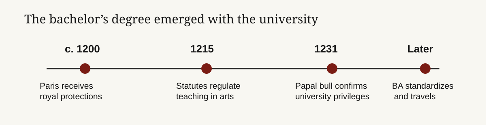

# The bachelor’s degree was not invented once—it became the first scalable credential

**Founder audience: builders of education, hiring, and credentialing products. The bachelor’s degree was not “made” by a single founder on a known day. It emerged in the medieval university as a supervised, intermediate rank between student and master, principally during the late twelfth and early thirteenth centuries. Its durable insight is less the curriculum than the interface: a portable signal that says a person has completed a common course and can enter the next gate. The opportunity for a modern credential is to make that signal more legible and useful without pretending that a badge alone creates capability.**

## TL;DR

- **The honest answer is a period, not a birthday.** Bologna and Paris developed organized universities around the twelfth century; Paris gained formal protections in 1200, statutes in 1215, and papal confirmation in 1231. In that system the baccalaureate became the junior degree in arts, before the master’s license to teach.[^1][^2]
- **“Bachelor” originally described a rank, not a four-year product.** Medieval arts students typically studied grammar, logic, and philosophy for years, passed examinations and disputations, and then held a junior status with teaching obligations. Cambridge’s record calls the BA its most junior degree and documents a medieval four-year arts course.[^3]
- **The credential scaled because it compressed uncertainty.** A university, curriculum, examination, and ceremony turned private learning into a public claim that employers, churches, and later states could recognize across distance.
- **Its weakness is also its moat.** The bachelor’s signal is broad, slow, and hard to compare by actual skill. That creates room for better evidence—but only if a new credential earns trust from both learners and the institutions that make consequential decisions.

*The bachelor’s degree is best understood as a product of institutionalization, not a single invention. Dates show Paris’s legal and organizational milestones; they do not establish the first individual graduate. Sources: Sorbonne and scholarly records cited below.*

## The first bachelor’s degree has no single timestamp

The question appears simple only because modern degrees are standardized products. Medieval learning was not. Cathedral schools, masters, students, bishops, monarchs, and emerging corporations negotiated authority over decades. Paris’s own history traces the association of masters and students through protections in 1200, a legate’s rules in 1215, and the papal bull *Parens scientiarum* in 1231.[^1] A specialist history of the university describes its institutional formation as stretching from 1208–09 to the middle of the thirteenth century.[^2]

That makes a specific first BA recipient impossible to substantiate from the readily available record. The useful historical answer is: **the bachelor’s degree emerged in the northern European medieval university system around the late twelfth and early thirteenth centuries, with Paris central to the arts model.** It was an intermediate credential, normally preceding the master’s degree and the right to teach. Later universities standardized and exported the model; they did not receive a finished product from one inventor.

The word itself carried rank before it carried an academic program. The bachelor was junior to a master, and the arts bachelor was part of a ladder of demonstrated competence. Cambridge’s institutional glossary still describes the BA as the university’s most junior degree; its account of the medieval course says it extended over four years and required examinations, formal responses, and a period “standing in quadragesima” before the full degree.[^3] The eventual master did not merely finish more classes: the master was admitted to teach. In other words, the original product had a clear economic role—controlled entry into a knowledge profession.

## Universities sold trusted coordination, not lectures

A contemporary founder can mistake the university for a content company. The medieval institution’s scarce asset was coordination. It assembled a curriculum, selected and regulated teachers, set an examination standard, conferred a recognized status, and maintained a record. Teaching existed outside universities; the university made the claim portable.

| Layer | Medieval function | Modern analogue | What creates trust |
| --- | --- | --- | --- |
| Curriculum | Shared arts course | Program requirements | A public, stable standard |
| Assessment | Disputation and examination | Performance assessment | Independent judgment |
| Status | Bachelor before master | Credential and transcript | A recognizable threshold |
| Network | Corporation of masters and students | Employer and alumni network | Repeated use by decision-makers |

The causal chain matters. Employers and authorities could rely on a degree because the university had incentives and standing to defend the standard; learners would pay time and money because the signal opened the next gate. A credential company that only delivers content has rebuilt the least defensible component. A company that can provide verifiable work, calibrated assessment, and a trusted decision network can create a new category—but it must earn all three.

## The four-year format is an adaptation, not the original rule

Modern readers often reverse the history: they assume a bachelor’s degree means four years, then look for the ancient origin of that package. The medieval arts course could be four years at Cambridge, but timing varied by place and era, and the degree’s social function came before today’s standardized duration.[^3] The U.S. four-year residential bachelor’s degree emerged much later through college organization, elective systems, accreditation, and labor-market convention.

That distinction is strategically useful. Time-in-seat is not the irreducible product. The irreducible product is a credible transition from *learner* to *recognized novice*: someone who has met a shared bar and can proceed into a profession, advanced study, or a higher-status role. Competency-based and apprenticeship models can unbundle duration. They cannot unbundle trust without losing the central value proposition.

## The real competitor is the hiring decision

For a founder, the buyer is rarely the learner alone. The learner pays with tuition, time, and opportunity cost; the employer, graduate program, regulator, or funder consumes the signal. The system works when a credential reduces the consumer’s cost of judging an unfamiliar person better than its alternatives.

This creates two distinct motions:

1. **Entry motion:** a learner needs access to a role, a visa, a regulated occupation, or further study. The credential’s value is eligibility.
2. **Selection motion:** a decision-maker must triage many applicants under uncertainty. The credential’s value is lower screening cost, even when it is an imperfect measure of skill.

The bachelor’s degree remains durable because both motions reinforce each other. Replacing it requires more than better instructional outcomes. A challenger needs employers to change filters, learners to risk a less-established path, and some mechanism that makes assessment comparable at scale.

## A founder playbook: build evidence before you build a diploma

| Phase | Action | Test | Lesson from the bachelor’s degree |
| --- | --- | --- | --- |
| Choose a wedge | Start with a role where capability can be observed in work. | Do five employers agree on the same hiring artifact and bar? | A degree mattered because it mediated a real professional transition. |
| Create a standard | Publish a narrow competency map and assess it with trained reviewers. | Can independent reviewers reach acceptable agreement? | The university’s authority rested on a shared, defensible threshold. |
| Make the signal portable | Give the learner a verifiable transcript, work sample, and assessment record. | Do employers use it without a custom explanation? | Ceremony and records turned learning into a public claim. |
| Add a network last | Partner with decision-makers who will hire, admit, or promote based on the evidence. | Track interview and hire rates against comparable applicants. | Recognition creates the flywheel; branding alone does not. |

The durable design rule is: **treat a credential as a market protocol.** Start with the decision it must improve, not the course catalog. Prove that the assessment predicts useful work. Then make the result easy for third parties to consume. The bachelor’s degree survived for centuries not because its original syllabus was immutable, but because its institutional wrapper converted learning into trusted access.

## Research notes and sources

[^1]: Sorbonne, [the medieval foundation and organization of the University of Paris](https://www.sorbonne.fr/la-sorbonne/histoire-de-la-sorbonne/la-fondation-de-la-sorbonne-au-moyen-age-par-le-theologien-robert-de-sorbon/). Primary institutional history for the 1200, 1215, and 1231 milestones.
[^2]: Nathalie Gorochov, [“Le sceau de l’université de Paris au XIIIe siècle”](https://www.persee.fr/doc/bsnaf_0081-1181_2015_num_2013_1_12138), *Bulletin de la Société nationale des Antiquaires de France*. Scholarly source describing the protracted institutional formation of Paris’s university.
[^3]: University of Cambridge, [BA glossary entry](https://glossary.lib.cam.ac.uk/term/ba). Institutional historical account of the BA’s junior rank, medieval course, examinations, and degree procedures.

<footer>Compiled August 27, 2026. Historical sources do not support identifying a single, first named recipient of a bachelor’s degree; the memo therefore gives a bounded institutional chronology rather than a false precision.</footer>
