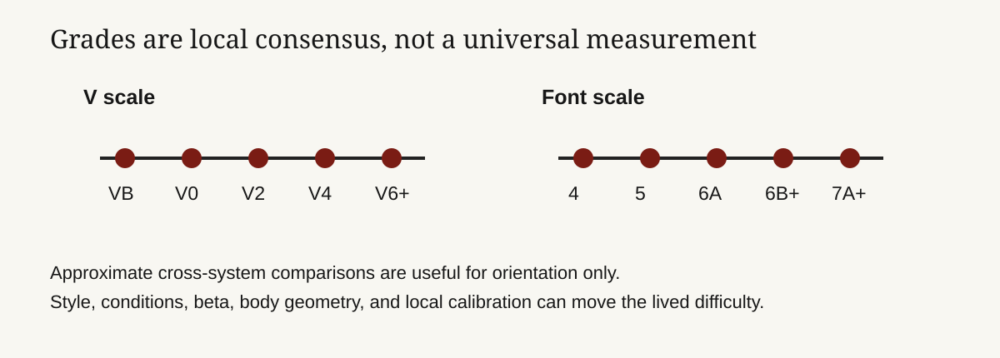

# Bouldering grades are a market signal, not a measurement system

**Founder audience: builders of athletic communities, marketplaces, training products, and performance data systems. Bouldering grades tell climbers where to spend attention, but they are not laboratory measurements. A grade is a community-negotiated prediction of difficulty under a particular style, height, condition, and sequence. The V scale dominates much of North America; the Fontainebleau (“Font”) scale dominates much of continental Europe and is used widely elsewhere. A good product treats grades as noisy, contextual metadata—not as a universal ranking of athletes.**

## TL;DR

- **Two systems anchor outdoor bouldering.** The Hueco or V scale begins around VB/V0 and progresses V1, V2, and upward; the Font scale uses numbers and letter suffixes such as 4, 5, 6A, 6A+, 6B. The UIAA publishes comparison tables but labels them approximate.[^1]
- **A grade rates a problem, not a person.** It reflects the hardest accepted sequence under expected conditions, not the climber’s height, reach, attempts, strength, or talent. Indoors, gyms may use colors, circuits, or locally invented labels; these are calibration systems, not translations.
- **Consensus is the mechanism.** First ascensionists propose a grade; repeat ascents, especially by climbers with relevant experience, tend to stabilize or revise it. Local ethics and conditions make exact cross-area conversion impossible.
- **For a product, preserve the evidence behind the label.** Grade, location, style, hold type, angle, conditions, ascent type, and user confidence produce a far better training and discovery system than a single global number.

*The systems are useful navigation tools, not exact equivalents. UIAA’s published comparison table is explicitly approximate. Source: UIAA, cited below.*

## The product is a route-level prediction of effort

A boulder problem is short enough that the grade cannot mean endurance alone. It typically bundles movement complexity, hold size and texture, body position, coordination, steepness, required power, friction, and the feasibility of a sequence. A slab with insecure feet can be hard in a different way from a roof with powerful compression. A tall climber may skip a move; a shorter climber may find a different beta. Humidity, skin condition, temperature, and a worn hold can change the effective difficulty without changing the printed grade.

That is why grades must not be treated as an objective measurement. The UIAA’s comparative table aligns V, Font, French, British, UIAA, and other systems, but calls it an **approximate comparative table**.[^1] The table is useful to choose a starting range when travelling. It is not a conversion API.

## V scale: discrete labels from Hueco Tanks

The V scale—often called the Hueco scale—uses `VB` for beginner problems in some areas, then `V0`, `V1`, `V2`, and so on. A `+` or `-` may appear around lower grades (`V0-`, `V0+`) and some guidebooks or gyms subdivide further. The system is named for John “Verm” Sherman, who developed the labels in Hueco Tanks, Texas, in the 1980s; it spread with the modern North American bouldering scene.[^2]

Its virtue is speed. A climber who regularly sends V4 can make a useful first guess about a V4 elsewhere. Its danger is false precision: V4 in one guidebook, season, or style can be materially different from V4 in another. Treat an integer step as a category label backed by local consensus, not a standard unit of force.

## Font scale: finer notation, same social process

The Fontainebleau scale grew from the bouldering culture around Fontainebleau, France. For boulders it is commonly written `4`, `5`, `6A`, `6A+`, `6B`, `6B+`, through 7 and 8 levels, with letter and plus increments. The UIAA table places V0 roughly around Font 4b, V2 around 5b, V4 around 6a/6a+, and V6 around 6c/6c+—a useful orientation that should not be read as a promise.[^1]

The finer notation does not make the underlying judgment more scientific. It gives a local community more labels with which to express consensus. A 6A may be technical, powerful, morpho, or conditions-dependent. The grade supplies a rough challenge band; the guidebook description, style tags, and repeated ascents supply the explanation.

| What a grade can do | What it cannot do |
| --- | --- |
| Help choose a problem near a climber’s current range | Predict every climber’s experience |
| Create a shared language within an area | Convert perfectly between V and Font |
| Support progression tracking over repeated comparable attempts | Measure force, intelligence, or athletic worth |
| Signal when a new problem may need more repeat data | Replace safety judgment, spotting, pads, or conditions assessment |

## How a grade gets made: proposal, repeats, revision

The grade normally begins with a first ascensionist’s proposal. That person establishes a legal, climbable line and estimates difficulty against known nearby problems. The next signal is repeat ascents: strong and experienced climbers compare the sequence, ask whether a key hold has changed, test alternative beta, and report an opinion. A guidebook author, local database, or community gradually converges on a number.

This is a marketplace rating problem with unusually high context. The valuable review is not the raw score; it is the reviewer’s relationship to the product: which height, which beta, which condition, whether it was a stand start or a sit start, whether a chipped hold or eliminated feature was used, and whether the climber matched the intended line. Without that metadata, an average can conceal the reason climbers disagree.

Indoor grades add another layer. A commercial gym may grade for safety, movement learning, turnover, and customer experience as well as relative difficulty. One gym’s color may deliberately span several V grades; another resets frequently and recalibrates with staff consensus. Never market a gym’s circuit color as a universal V or Font equivalent unless the gym explicitly supplies that mapping and understands the limitation.

## The athletic product should measure a portfolio, not a max grade

An app that reduces a climber to “highest send” encourages distorted behavior: avoiding slabs, chasing a soft benchmark, or treating one perfect conditions day as permanent ability. The better profile is a portfolio:

| Field | Why it matters |
| --- | --- |
| Grade system and local area | Keeps comparisons anchored to a calibration context |
| Angle, style, hold type, and height | Explains why a grade may be easy or hard for this athlete |
| Send style: flash, send, repeat, projected | Distinguishes route reading from persistence |
| Attempts and sessions | Captures effort without pretending it is universal |
| Conditions and hold state | Preserves changes that affect repeatability |
| Confidence / community agreement | Flags grades with little evidence or active disagreement |

This product design shifts the incentive from bragging rights to useful feedback. It can recommend a project that stretches the climber’s weak style, show whether outdoor performance differs from gym performance, and identify suspect grades that need more repeat data. It also protects against the most common trust failure: telling a user their body or training is wrong when the measurement is actually local noise.

## Founder playbook

1. **Store grades as structured data, not strings.** Capture system, value, modifiers, area, version, and source. Test: can the product display `V4`, `6A+`, and a gym color without inventing an equivalence?
2. **Make uncertainty visible.** Show proposed, consensus, and disputed states, plus number of knowledgeable repeats. Test: do users see why a grade moved rather than merely noticing a changed label?
3. **Design for style-aware progression.** Ask for angle, holds, start position, and ascent type. Test: can recommendations improve after ten logged problems without using a global leaderboard?
4. **Keep safety and ethics out of the score.** Add area-specific access, landing, pad, and environmental information as first-class fields. Test: can a climber plan a responsible attempt without leaving the product?

The enduring lesson is that **a grade works when a community can challenge it.** A platform should help local knowledge travel without flattening it into a pseudo-scientific score. Get the data model right, and grades become useful inputs to discovery, coaching, and safety—not a brittle identity label.

## Research notes and sources

[^1]: UIAA, [*The Scales of Difficulty in Climbing*](https://www.theuiaa.org/documents/sport/THE-SCALES-OF-DIFFICULTY-IN-CLIMBING_p1b.pdf), especially its approximate comparative table for boulder and climbing scales. Primary federation reference for the existence and approximate relation of V and Font systems.
[^2]: John Sherman, [*Better Bouldering*](https://www.mountaineersbooks.org/product/9781594851964/), Mountaineers Books. Historical and practitioner reference for the Hueco/V scale’s development. The UIAA document above is used for comparative notation, not a claim of exact conversion.

<footer>Compiled and checked August 27, 2026. Grades change with conditions, access, hold breakage, style conventions, and local consensus. Check current local guides and respect area-specific access and safety practices.</footer>
