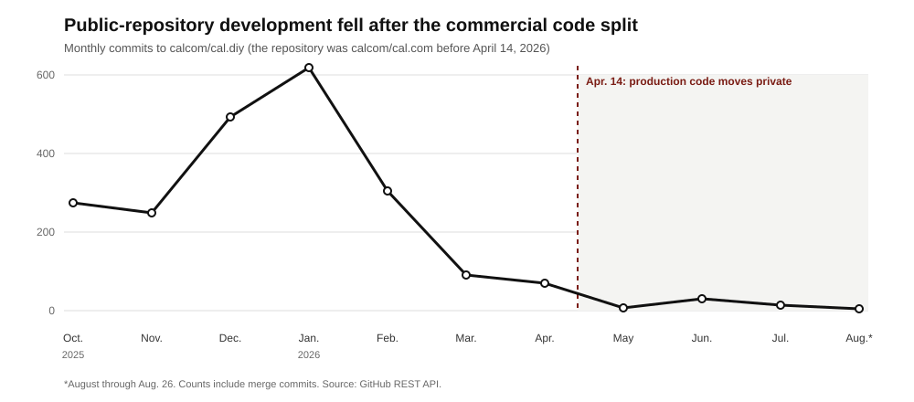

# Cal.com: open source got it into the race; closing source changes how it must win

**In 2021, Peer Richelsen searched for “Calendly open source” because Calendly could schedule his own calls but could not disappear inside a hiring marketplace with roughly 5,000 users. The missing result became Cal.com. Publishing the code did far more than signal openness: product teams could reshape the booking flow, enterprises could inspect and self-host it, GitHub brought users and contributors, and several contributors became employees. Bailey Pumfleet says the first 500,000 users arrived without a sales team, outbound sales, or growth marketers. Five years later, Cal.com moved its production code into a private repository. The company gives one reason—AI had made public code an increasingly useful attack map for sensitive calendar, healthcare, and deal-flow data—and explicitly denies that the business model had failed. But the commercial consequence is larger than a security change. Cal.com is now replacing an asymmetric advantage against Calendly—inspectable code, self-hosting, community development, and nearly free developer distribution—with a more conventional promise: better routing, APIs, enterprise control, reliability, and agents. Cal.diy preserves a free individual scheduler, but not the shared product-development loop that got Cal.com into the race.**

## The position in five facts

- **Customers buy coordination logic, not a calendar link.** Cal.com checks availability across calendar providers and time zones, routes a booking to the right person, writes the event back to connected systems, and triggers reminders, CRM updates, payments, or follow-ups.
- **Two buying motions proved different value.** Cal.com says more than 1,200 Deel employees use it across sales, support, and customer success, with a 15% increase in sales close rates. Retell AI embedded Cal.com into voice agents handling more than ten million calls per month and says the integration saves each customer more than two development days. These are vendor-published, unaudited claims.
- **Open source solved the product and distribution problems together.** It let marketplaces change the workflow, gave security-conscious buyers deployment control, differentiated Cal.com from Calendly, and turned users into contributors and hires. Pumfleet says the first 500,000 users arrived without a sales or growth team. The repository grew from about 6,200 GitHub stars around the 2021 launch to 47,949 by August 2026.
- **The code split matches the paid boundary.** Cal.diy retains the scheduling engine, booking flows, App Store framework, and API v2. Teams, organizations, routing forms, workflows, SAML/SSO, analytics, audit logs, and other commercial features moved into the private product. Current annual pricing is free for one individual, $12 per user per month for Teams, $28 for Organizations, and custom for Enterprise.
- **Private execution is fast; its business result is still unknown.** Cal.com released commercial versions 6.4 through 6.8 from April through August 2026. The public repository has issued no release since v6.2 in March. Public commits fell from 1,318 in the four months before the split to 107 in the following four months. Current ARR, retention, enterprise win rate, security incidents, and self-hosted-to-paid conversion remain private.

## Cal.com sells the rules around a meeting

The visible product resembles Calendly: a person connects calendars, declares availability, publishes a booking page, and lets another person choose an open time. The economic product begins when a meeting belongs to a system rather than one person.

A sales organization must qualify a lead, read account ownership from Salesforce, select a rep under territory and fairness rules, write the meeting back to the CRM, and trigger follow-ups. A healthcare operator must respect provider geography and privacy. A marketplace must coordinate thousands of users without buying a seat for every participant. These flows cross identities, calendars, time zones, and external applications; failure can lose a lead, deny care, or expose data.

Cal.com replaces that integration and operating burden. Individuals receive a hosted scheduler for free. Teams pay for shared availability, round robin, routing, and analytics. Organizations add sub-teams, advanced routing, SAML, SCIM, roles, and compliance. The buyer is an operations, revenue, product, or IT leader; the users are employees, providers, marketplace participants, and their bookers.

Recurring per-user revenue pays Cal.com to operate the service, integrations, support, and security program. That hosted burden is the tollbooth: scheduling gains value when the vendor maintains calendar-provider behavior, identity, routing, data controls, and uptime. Cal.com chose to make the differentiated application private, not because the engine lacked another monetization path.

## Open source let Cal.com compete asymmetrically with Calendly

Calendly remains the closest comparison because the products now overlap across individual links, round robin, lead routing, CRM integration, SSO, administration, and analytics. The difference is no longer “simple link versus developer platform.” Calendly has added a write-capable Scheduling API, enterprise routing, MCP access, an email assistant, a voice-agent booking interface, payments, and meeting automation. It also has the stronger brand, a mature sales organization, and a large installed base.

| Dimension | Cal.com | Calendly | Consequence of Cal.com closing source |
| --- | --- | --- | --- |
| Annual list price | Free individual; Teams $12/user/month; Organizations $28/user/month; Enterprise custom | Free; Standard $10/seat/month; Teams $16/seat/month; Enterprise starts at $15,000/year for 50 seats | Price alone does not create a durable wedge. Both can package by team and enterprise value. |
| Enterprise product | Routing, workflows, Salesforce, SAML/SCIM, audit logs, analytics, APIs | Routing, managed event types, Salesforce and marketing automation, SAML, domain control, audit logs, implementation support | Cal.com must win feature-by-feature on workflow depth, reliability, implementation, and support. |
| Developer control | API v2, embeds, Cal Atoms, unified calendar API, Cal.diy self-hosting | Scheduling API, embeds, webhooks, MCP and integrations | Cal.com retains a composability advantage, but production code is no longer part of the proof. |
| Distribution advantage | Historically GitHub, contributors, self-hosting, and “open-source Calendly” search intent | Brand, integrations, product-led adoption, and enterprise sales | Cal.com must replace some organic acquisition with enterprise go-to-market while keeping Cal.diy useful enough to send qualified teams upstream. |

While the production product was open, Cal.com could make a promise Calendly could not: inspect the actual application, change it, host it, or contribute back. That gave a much smaller company a credible reason to enter a settled category. After the split, Cal.com competes more like a conventional SaaS vendor. Its remaining advantages are product architecture and execution—composable UI, scheduling APIs, calendar connectivity, complex routing, deployment options, and shipping speed—not access to the code that serves paying customers.

## Deel proves the managed-enterprise motion; Retell proves the original infrastructure motion

**Deel buys coordination inside a large organization.** Cal.com says more than 1,200 employees use its routing across sales, support, and customer success and attributes a 15% increase in sales close rate to the deployment. **Retell AI buys infrastructure inside another product.** Its voice agents inspect availability and manage appointments; Cal.com says the integration saves each Retell customer more than two development days. The outcomes are unaudited, but the value is clear: consistent revenue operations in the first case, avoided engineering in the second.

The motions no longer receive equal emphasis. In January 2026, Cal.com stopped accepting new customers for end-to-end white-label Platform and shifted toward branded “Continue with Cal.com” OAuth partnerships. APIs and embeds remain, but managed enterprise workflow—not invisible usage-priced infrastructure—is now the center of the offer.

## What open source actually bought Cal.com

Open source was initially a product requirement. At Lean Hire, per-seat software did not fit a marketplace whose users booked one another, and pasted Calendly links hid bookings, cancellations, and reschedules from the marketplace. Richelsen needed scheduling he could place inside the product, observe, and change. The public application then performed five jobs for the company:

| Job | How openness created value | Evidence |
| --- | --- | --- |
| Make an embeddable product possible | A marketplace could alter identity, booking, and notification flows instead of wrapping a third-party link. Self-hosting removed seat economics and platform dependency. | Cal.com grew from the unmet Lean Hire use case, not a generic preference for public code. |
| Create category differentiation | “Open-source Calendly alternative” was a sharp answer to why another scheduler should exist. It attracted buyers who valued control, privacy, and extensibility. | Cal.com’s name, early launch narrative, GitHub presence, and product positioning all centered the contrast. |
| Compress buyer diligence | Engineers could inspect the application before a call; regulated or privacy-sensitive operators could self-host; product teams could prototype without procurement. | Pumfleet later said openness helped downstream sales with compliance, privacy, and extensibility even though competitors could copy the code. |
| Acquire users without a conventional go-to-market team | GitHub, Product Hunt, developer search, forks, and self-hosting created high-intent inbound demand. | Pumfleet says the first 500,000 users arrived without sales, outbound, or growth marketers. Around launch Cal.com reported 6,200 stars and an 800-person Slack. |
| Extend and recruit the team | Contributors fixed issues, built integrations, demonstrated skill in public, and became candidates with a working history. | The core team grew from two to 12 around launch; Cal.com said many of the hires came from contributors. Its seed announcement counted 76 contributors. |

These benefits reinforced one another. A product team found Cal.com because it was open, proved the workflow by changing or hosting it, surfaced an integration or bug, and sometimes contributed or bought the managed version. The repository was therefore product, proof, acquisition channel, support surface, and recruiting funnel at once.

The weakness was conversion. Cal.com’s 2023 Series A memo said acquiring free and self-hosted users was easier than turning them into revenue. The company tried consumer SaaS, enterprise contracts, and usage-priced infrastructure under a “Stripe for time” thesis. Over time, the paid surface accumulated where recurring operational risk lived: organizations, permissions, routing, workflows, analytics, CRM ownership, compliance, and support. In January 2026, Cal.com stopped accepting new customers for its fully white-label Platform offer and favored branded OAuth partnerships. The center of gravity had become the managed enterprise application.

Closing production source breaks part of the original loop. A developer can still discover, run, and modify Cal.diy, but cannot inspect the code operating Cal.com Cloud, contribute a fix to that product, or validate that the public and hosted products behave the same way. Cal.diy can remain a useful top-of-funnel product. It is a weaker trust artifact, contribution engine, and enterprise proof than the shared application was.

## Cal.com says security—not failed economics—caused the closure

The April 14 announcement gives “one simple reason”: AI can inspect public code for vulnerabilities faster and more cheaply than human attackers could. Pumfleet pointed to healthcare appointments and market-moving deal flow; the application crosses identity, OAuth, billing, credentials, and integrations. Public advisories included critical authentication bypasses in December 2025 and January 2026, and Cal.com says production authentication and data handling had already undergone major rewrites.

There is no second official reason. In public comments, Pumfleet says Cal.com was profitable, had grown roughly 300% a year, and could continue to make money while open; he argues that closure hurts the business more than it helps. In a documentary about the decision, he also rejected the familiar motives of forcing payment or preventing free access. Those are company claims, but they matter: the available record does not support presenting monetization failure or competitor copying as a disclosed cause.

The business context is still relevant. Cal.com had begun building a go-to-market organization, curtailed white-label Platform, and accumulated paid enterprise features in code that had diverged from the public core. Closure did not create those changes or prove a hidden motive. It commits the company to their consequence: enterprise selling and private execution must replace more of the distribution, trust, and contributor leverage openness supplied.

Private authentication and data-handling code can reduce attackers’ advance knowledge and buy defenders time. It cannot establish security: public endpoints expose behavior, dependencies disclose vulnerabilities, and Cal.diy still needs patches. The test is whether serious findings, exploit dwell time, and remediation time fall—not whether outsiders can see fewer advisories.

The technical execution reveals the full decision. On April 15, Cal.com renamed the old public monorepo `calcom/cal.diy`, changed its license from AGPL 3.0 to MIT, and moved production development to a private repository. Cal.diy kept individual scheduling, the App Store framework, booking flows, and API v2. It lost the product areas that map to paid collaboration and enterprise administration:

| Removed from Cal.diy | Economic role in Cal.com |
| --- | --- |
| Organizations, teams, permissions, and team booking | Creates the per-user collaboration product |
| Routing forms, Salesforce routing, and traces | Connects scheduling to revenue operations |
| Workflows, reminders, triggers, and follow-ups | Automates recurring operational work |
| SAML/SSO, audit logs, analytics, impersonation | Satisfies administration, security, and compliance buyers |
| Instant booking, AI phone, segments, enterprise UI | Expands differentiated application scope |

Cal.com says former interns now maintain the hobbyist and individual edition while commercial engineers focus on the private product. The split creates two products, two teams, and a one-way boundary: Cal.diy’s README says community contributions do not flow into production.

Discourse shows the alternative. Two days later, the community platform said it would remain GPL and use models defensively to find vulnerabilities. That requires mature response, coordinated disclosure, rapid patches, and continuing investment in a public core. Cal.com chose lower exposure and tighter control over shared review, contributor leverage, and a common artifact.

## The private team is shipping toward a scheduling operating system

| Date | Operating signal |
| --- | --- |
| Dec. 2021 | $7.4M seed; roughly 9,000 GitHub stars reported around the period |
| Apr. 2022 | $25.0M Series A; App Store and API strategy expanded |
| Jan. 2026 | Full white-label Platform closed to new customers; branded OAuth partnerships became the new direction |
| Apr. 14–15, 2026 | Production code moved private; Cal.diy launched under MIT without commercial features |
| Aug. 2026 | 47,949 GitHub stars; more than 1M users claimed; commercial v6.8 shipped |

*Public commits fell from 1,318 in the four months before the split to 107 in the next four months. The pre-split repository included Cal.com’s commercial engineers, so the decline is evidence of organizational separation—not community rejection. Counts include merge commits; August runs through August 26. Source: GitHub REST API.*

The releases reveal three connected product bets:

| Shipping vector | Recent work | Economic thesis |
| --- | --- | --- |
| Enterprise coordination | Salesforce routing and traces, round robin, organization history, audit logs, SCIM, analytics, performance, and troubleshooting | Own the high-risk rules around who gets a meeting, then earn recurring team and organization revenue. |
| More of the meeting lifecycle | Cal.com Notes, Cal Pay, ticketed events, guest lists, refunds, workflows, and conditional paths | Expand from choosing a time into preparing for, transacting around, and following up on a meeting. |
| Agent access | Cal.com Agents in Slack, Telegram, email, and terminal; CLI skills; hosted MCP; natural-language routing-form creation | Become the scheduling action layer used by both humans and software agents. |

The public project is active but structurally behind. GitHub records 107 commits after April 14 through August 14; the latest public release remains v6.2 from March 1. Its stars and forks are inherited from the original repository, so they do not measure post-split adoption.

These leading indicators show separation and continued shipping, not improved security, conversion, retention, or growth. Cal.com claims more than one million verified users and 20 million total bookings, but has not disclosed current ARR, paid customers, retention, revenue mix, acquisition cost, or incident rate. The figures are company-reported; conflicting third-party estimates cannot resolve the question.

## Agents may become the new open surface, but they are not yet the center of gravity

Cal.com serves agents in two senses. A person can ask a Cal.com agent in Slack, Telegram, email, or a terminal to find time, book, reschedule, or cancel. A developer can give an external agent those actions through API v2, the CLI, a hosted MCP server, and published skills. Cal.com supplies the difficult layer beneath the conversation: authenticated calendars, availability, routing, permissions, workflows, and reversible writes.

That makes agents a distribution opportunity. APIs, commands, MCP, and skills could become a new open integration surface: developers find Cal.com because an agent needs to schedule, then pay it to operate the system. But Calendly also offers MCP, email assistance, and voice-agent booking. Cal.com must prove finer permissions, deeper routing, clearer logs, and more reliable writes—not merely an AI interface.

The release record does not show an agent-only company. Most work still strengthens enterprise coordination or expands the meeting lifecycle. The coherent strategy is to become the operating system around a meeting, reached through a page, embed, API, or agent. Notes, payments, events, workflows, routing, and agent channels either reinforce one scheduling graph or become distracting product sprawl.

Three outcomes will distinguish focus from drift:

- **Enterprise workflow wins.** Routing, compliance, administration, and support raise contract value and retention; the new sales team replaces organic growth efficiently.
- **An agent and developer flywheel emerges.** API-, MCP-, and agent-created bookings grow, Cal.diy remains useful, and both surfaces send teams into the managed product.
- **The surfaces fragment.** Cal.diy becomes a museum, agent interfaces remain demos, adjacent products dilute the roadmap, and Cal.com pays to acquire demand that open source once delivered.

Track enterprise win rate against Calendly, sales cycle, retention, acquisition cost by source, and free-to-team expansion. For agents, track successful writes, reversals, API-created booking share, connected accounts, and paid conversion. For Cal.diy, track active installs, releases, maintainers, issue latency, and paid pipeline. Until those move, closure and rapid shipping remain inputs—not proof of a stronger business.

## What founders should do at each phase

| Phase | Action | Test or metric | What Cal.com teaches |
| --- | --- | --- | --- |
| Before product-market fit | Write the user constraint that requires open source—self-hosting, modification, auditability, data control—not the marketing benefit. | Interview 20 target operators; count how many cannot adopt without source access or deployment control. | Lean Hire needed observable, customizable scheduling for 5,000 marketplace users; conventional per-seat links could not do the job. |
| When community distribution works | Separate attention from economic contribution. Instrument how a repository visitor becomes a hosted user, paid team, enterprise lead, contributor, or hire. | Track source-to-signup, self-hosted-to-paid, contributor output, support burden, and acquisition cost by channel each quarter. | GitHub, Product Hunt, Slack, and contributors accelerated Cal.com, but the 2023 memo already identified conversion as the harder problem. |
| Before closing or splitting code | Model three organizations: one shared open core, source-available delayed releases, and separate community/commercial products. Budget maintainers, security backports, release cadence, and migration. | Set a six-month gate for public release frequency, critical-patch latency, maintainer capacity, lost leads, and commercial engineering velocity. | Cal.com created two repositories and teams; four-month public commits dropped by more than 90% while private commercial releases continued monthly. |
| After citing security | Define the result that secrecy must improve and publish an appropriately aggregated scorecard. Keep a defense-in-depth plan independent of visibility. | Track critical findings, exploit dwell time, patch time, penetration-test results, bug-bounty yield, and security-review win rate. | Private code can buy time, but Discourse shows that AI-assisted defensive review and rapid public patching are a credible alternative. |
| After the split | Maintain an explicit contract with the community edition: supported users, feature boundary, security policy, release target, and route to the paid product. | Measure active installs, new maintainers, unresolved critical issues, release lag, and paid pipeline sourced from the edition. | Cal.diy is more permissive under MIT, but contributions no longer reach production and no public release has followed the split. |

The practical lesson is not “stay open” or “close when large.” **Use open source when it changes what customers can do or gives the company a scarce learning and distribution advantage. Build the paid boundary around recurring operational value before the payroll depends on conversion. When the commercial product diverges, decide whether you can fund one shared core or must operate two real products. If security drives the change, state the measurable security outcome. Then judge the decision by retained distribution, product velocity, incident performance, and revenue quality—not by the neatness of the new license boundary.**

## Sources and research notes

1. Cal.com, [why the company was built open source](https://cal.com/blog/open-source), 2022; [v1 and rebrand](https://cal.com/blog/calendso-rebrands-to-cal-com); and [v2](https://cal.com/blog/cal-v-2-0). Primary sources for the Lean Hire problem, initial open-source rationale, early team/community figures, and consumer/infrastructure positioning. Dates on migrated legacy posts are inconsistent; the memo uses the product chronology described in the posts and dated funding releases.
2. Cal.com, [$7.4 million seed announcement](https://cal.com/blog/seed) and [$25 million Series A and v1.5](https://cal.com/blog/cal-v-1-5). Primary sources for the $32.4 million total and the App Store/API funding thesis.
3. Cal.com, [Series A memo](https://cal.com/blog/series-a-memo), Apr. 2023. Primary source for the three original monetization motions, then-current infrastructure price, acquisition/conversion framing, and “Stripe for time” strategy. Pipeline and virality figures in the memo were forward-looking company claims, not realized results.
4. Cal.com, [current pricing](https://cal.com/pricing), and Calendly, [current pricing](https://calendly.com/pricing), checked Aug. 27, 2026. Primary sources for annual list prices and plan boundaries. Enterprise prices are not directly comparable: Calendly publishes a 50-seat starting price while Cal.com quotes Enterprise individually.
5. Cal.com customer materials: [Deel smart routing](https://cal.com/smart-routing) and [Retell AI](https://cal.com/blog/how-retell-ai-saved-thousands-of-hours-of-development-time-with-cal-com). Vendor and customer claims; reported outcomes have not been independently audited.
6. Cal.com, [v6.1](https://cal.com/blog/calcom-v6-1), Jan. 2026; and [Platform FAQ](https://cal.com/docs/platform/faq). Primary sources for the move away from full white-label managed users toward branded OAuth partnerships and the Platform plan’s closure to new customers.
7. Cal.com, [closure announcement](https://cal.com/blog/cal-com-goes-closed-source-why), Apr. 14, 2026; [technical split](https://cal.com/blog/cal-diy-open-source-to-closed-source), Apr. 15; [v6.4](https://cal.com/blog/calcom-v6-4); and [Cal.diy README](https://github.com/calcom/cal.diy/blob/main/README.md). Primary sources for the security rationale, production divergence, removed features, maintainers, repository separation, licenses, and one-way contribution boundary.
8. Bailey Pumfleet, [closure explanation](https://www.linkedin.com/posts/baileypumfleet_open-source-is-dead-thats-not-a-statement-activity-7450177472979058688-yN0l), [decision documentary](https://www.linkedin.com/posts/baileypumfleet_making-time-documentary-ep02-calcoms-decision-activity-7450984760463704064-kUg7), and [Hacker News discussion](https://news.ycombinator.com/item?id=47780712), Apr. 2026. Founder statements for sensitive-data examples, business performance, and the denial that failed monetization or restricting free access caused the closure. Growth and profitability are unaudited company claims.
9. Bailey Pumfleet, [building a go-to-market team after the first 500,000 users](https://www.linkedin.com/posts/baileypumfleet_we-built-calcom-incs-first-500000-users-activity-7367549308738363392-YI06), 2025; and Linux Foundation/Serena Capital, [Open Source Startups in Europe](https://www.linuxfoundation.org/hubfs/Research%20Reports/lfr_serena_capital_report_082225b.pdf?hsLang=en), 2025. Primary founder statement for the no-sales acquisition claim and a research interview for openness as a sales aid in compliance, privacy, and extensibility.
10. GitHub, [Cal.diy security advisories](https://github.com/calcom/cal.diy/security/advisories). Primary repository record for disclosed critical vulnerabilities before the change. An advisory list is not a complete incident history.
11. Discourse, [Discourse is not going closed source](https://blog.discourse.org/2026/04/discourse-is-not-going-closed-source/), Apr. 16, 2026. Primary comparator for the alternative choice to keep an application public and use AI defensively.
12. Cal.com, [Cal.com versus Calendly APIs](https://cal.com/blog/calendly-api-vs-cal-com-api), Aug. 2026; and Calendly, [product announcements](https://calendly.com/blog). Vendor sources for current API, MCP, assistant, voice-agent, automation, and enterprise capabilities. Each company’s competitive framing is treated as marketing, not independent evaluation.
13. Cal.com, [Agents](https://cal.com/agents), [agent documentation](https://cal.com/docs/agents), and [hosted MCP server](https://cal.com/docs/mcp-server). Primary sources for Slack, Telegram, email, CLI, skills, API actions, OAuth, and MCP access.
14. Cal.com, [2026 engineering plan](https://cal.com/blog/engineering-in-2026-and-beyond), [v6.3](https://cal.com/blog/calcom-v6-3), [v6.5](https://cal.com/blog/calcom-v6-5), [v6.6](https://cal.com/blog/calcom-v6-6), [v6.7](https://cal.com/blog/calcom-v6-7), and [v6.8](https://cal.com/blog/calcom-v6-8). Primary sources for the pre-split organization, agent launch, current user and booking claims, and monthly commercial shipping through August.
15. GitHub REST API, [repository](https://api.github.com/repos/calcom/cal.diy), [commit history](https://api.github.com/repos/calcom/cal.diy/commits), and [releases](https://api.github.com/repos/calcom/cal.diy/releases). Current values checked Aug. 27, 2026. Monthly commit totals include merge commits; equal four-month windows are Dec. 14, 2025–Apr. 13, 2026 and Apr. 14–Aug. 13, 2026.
16. Cal.com, [current customer directory](https://cal.com/customers) and [About](https://cal.com/about). Primary sources for company-reported user scale and infrastructure positioning. The figures are not independently audited.

*Compiled and checked August 27, 2026. Cal.com has not disclosed current revenue, ARR, revenue mix, paid customer count, retention, security incident rate, or a post-Series A financing. Third-party estimates were excluded from the argument because they conflict and are not company-confirmed.*
