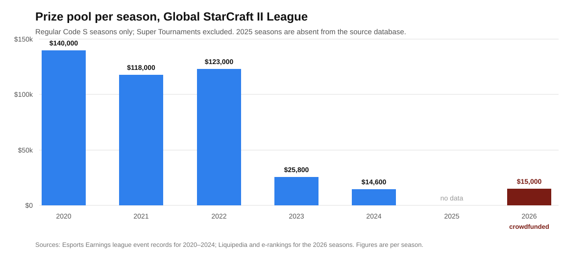

# Chess and tennis keep the rules-maker, the rating-keeper and the tournament in three organisations. StarCraft keeps them in one.

**Founder audience: builders of competitive platforms, matchmaking systems and any product whose users accumulate a score. A FIDE title survives FIDE. An ATP ranking is computed from results the tour does not own, at events it does not all control, under rules that have not meaningfully changed in a century. A StarCraft II matchmaking rating is a number of undisclosed construction, held on a Battle.net account, measuring a game whose balance is rewritten by the same company that keeps the rating, awarded rank in a fixed top-200-per-region ladder that demotes the bottom five percent every day and expires the number if you stop playing. That vertical integration is what makes esports ratings feel so responsive and so worthless simultaneously — and in 2026 it produced the outcome the structure always allowed. The Esports World Cup put up $75 million across twenty-four games and did not include StarCraft II or any other real-time strategy title. The premier league in the sport ran on crowdfunding with a $15,000 prize pool. The only rating in the game that has kept publishing continuously is maintained by volunteers.**

## The position in six facts

- **Rank is leased, not held.** StarCraft II's Grandmaster league is a fixed top 200 per region. Holding a place requires at least thirty games every three weeks, and the bottom five percent of the league is automatically demoted every day at 17:00 local time. The underlying MMR is a number Blizzard computes and does not fully document.[^1]
- **The game stopped being developed six years ago and the rating keeps moving.** Blizzard ended paid content development for StarCraft II in October 2020, while continuing to issue balance patches.[^2] Each patch changes what a rating point means, and it is issued by the party that keeps the rating.
- **The premier league's prize pool fell by ninety percent.** Global StarCraft II League seasons paid $140,000 in 2020, $118,000 in 2021 and $123,000 in 2022, then about $25,800 per season in 2023 and about $14,600 in 2024. The 2026 seasons were crowdfunded revivals at $15,000, twelve players each, with herO beating SHIN 4–2 in the Season 1 final in Seoul on May 17.[^3]
- **The ESL Pro Tour ended in April 2025, and the Esports World Cup dropped the game entirely in 2026.** EWC 2026 fielded a $75 million prize pool across twenty-five tournaments in twenty-four games, with more than 2,000 players and 200 clubs — and no StarCraft II, and for the first time no RTS title of any kind.[^4] Two years earlier Clem had won $400,000 from EWC's $1 million StarCraft II pool.[^5]
- **Tracked annual prize money collapsed.** Across events recorded by Esports Earnings, StarCraft II paid $3.17 million to 402 players across 387 tournaments in 2019, $2.17 million to 154 players across 175 tournaments in 2024, and $736,027 to 30 players across 7 tournaments in 2025. In the 2026 table it does not appear at all — below Age of Empires II, a 1999 release, at $506,114 across 142 tournaments.[^6]
- **The independent rating outlived the commercial infrastructure.** Aligulac, a volunteer-run Bayesian rating of StarCraft II professionals, was still finalising rating lists through 2026.[^7]

## What an MMR is, contractually

Every rating discussed in the sibling memos on [chess](chess-elo.md) and [tennis](tennis-rankings.md) is a claim about a person that outlives the institution recording it. A grandmaster title is awarded for life and is recognised whether or not the awarding federation still exists in its current form. An ATP ranking is recomputed from a public register of results; if the ATP vanished tomorrow, the match record would remain and any competent statistician could rebuild the list.

A StarCraft II MMR is none of these things. It is a value in a vendor's database, attached to a Battle.net account, describing performance in a product that vendor licenses to you. It cannot be exported into any other system, it is not recognised by any body outside the game, and it stops existing when the servers do. Blizzard displays it, but the matchmaking formula and the mapping from MMR to league boundaries are not published in full.

The tenancy terms are unusually explicit. Grandmaster is not a threshold, it is a fixed allocation of 200 seats per region — an admissions quota, not a standard. Keeping a seat requires thirty games every three weeks, and each day the bottom five percent are demoted regardless of whether they played badly.[^1] The score decays toward nothing the moment you stop feeding it.

That is a good matchmaking system. It queues players fairly and fast, which is the job. It is a terrible credential, and the confusion between the two is where founders in this category lose years.

## A balance patch is a silent revaluation

FIDE's March 2024 rating adjustment moved 350,000 chess ratings by up to 400 points and was reported worldwide as a significant intervention. It happened once, was announced in advance, was accompanied by a published formula, and was debated by named statisticians.

StarCraft II does the equivalent quietly and repeatedly. Blizzard ended paid content development in October 2020 and has continued to ship balance patches since — adjusting unit costs, build times and abilities.[^2] Every such change alters the relationship between the skills a player has and the results the ladder records, which is to say it alters what the MMR measures, without altering the number. A 5,200 MMR in 2021 and a 5,200 MMR in 2026 are not the same claim about a person, and there is no version stamp on the score that tells you so.

The structural point is not that Blizzard is careless. It is that **the party that changes the rules and the party that keeps the score are the same party, and there is no mechanism by which anyone can object.** Chess separates these: FIDE keeps ratings but the rules of chess are not FIDE's to rewrite in any commercially meaningful way. Tennis separates these: the ATP keeps the rankings, the ITF governs the rules of the game, and the four events worth the most points are owned by neither. In esports the separation does not exist, cannot be created by the community, and is not contemplated by the licence agreement under which the game is played.

## The funding cliff, in one chart

*The GSL has been the sport's premier league since 2010. The 2022-to-2023 step is a roughly 79% cut in a single year. Regular Code S seasons only; Super Tournaments excluded. 2020–2024 figures from Esports Earnings league records, 2026 from tournament listings. Seasons ran in 2025 but are not recorded in the source database used here.*

The same shape appears at the top of the pyramid. Annual prize money across tracked events fell from $3.17 million in 2019 to $736,027 in 2025, but the more revealing column is the count of players earning anything: 402 in 2019, 227 in 2023, 154 in 2024, 30 in 2025.[^6] A competitive scene is not primarily a prize pool, it is the number of people for whom the activity clears subsistence. That number went from a few hundred to a few dozen in six years.

Two decisions did most of it. The ESL Pro Tour, which had supplied the circuit's institutional backbone, ended in April 2025. The Esports World Cup, which had partly replaced it and which paid Clem $400,000 in 2024, dropped the game from its 2026 programme — from a $75 million pool spread across twenty-four titles.[^4][^5] Neither decision was made by anyone accountable to StarCraft II players, and neither required notice.

The community reaction captures the dependency precisely. The commentator Kaelaris: "I suspect that also means I won't be doing any SC2 in 2026 since that was the only place nowadays that fancies taking a desk host for the game." The creator Simon 'Lowko' Heijnen: "Very sad to not have StarCraft 2 or any other RTS game at the EWC this year. Especially considering views and interest has been up noticeably."[^4]

Note Heijnen's clause. Interest was reportedly up. The rating still went to zero economically, because the rating was never connected to demand — it was connected to two organisations' calendar decisions.

## What the player owns at the end

Set the outcomes side by side, because the asymmetry is the entire memo.

| | Chess | Tennis | StarCraft II |
| --- | --- | --- | --- |
| Who sets the rules | FIDE, by congress; the game itself is unowned | ITF, with the Grand Slams | Blizzard, by patch |
| Who keeps the rating | FIDE (and chess.com, Lichess, independently) | ATP/WTA; UTR and ITF independently | Blizzard only |
| Who runs the top events | FIDE, plus independent organisers | ATP, WTA, ITF and four independent Slams | Third parties, at the publisher's licence |
| Underlying results | Public game records, permanently | Public draw records, permanently | Vendor database, non-exportable |
| What survives the institution | The title, for life | The result record | Nothing |
| Cost to keep the number | One rated game whenever you like | 52-week decay | 30 games every 3 weeks |

Serral has earned $1.87 million and Maru $1.39 million playing StarCraft II, out of $43.5 million awarded across 7,535 tournaments since 2010.[^8] Those are careers, and they were real. But a retiring grandmaster keeps a title that will appear next to their name for the rest of their life, and a retiring StarCraft professional keeps a screenshot.

## The volunteers outlasted the institutions

The durable artifacts in this ecosystem were all built by people who were not paid to build them.

Aligulac has rated StarCraft II professionals since the early 2010s on a Bayesian model with matchup-specific sub-ratings constrained to the general rating, weighting wins by opponent strength. It was still publishing finalised rating lists in 2026, having outlasted the World Championship Series, the ESL Pro Tour and the game's own development team. It also announced in May 2026 that it would drop HTTP support for its API by the end of June — the housekeeping of a project run on someone's evenings.[^7] SC2 Pulse performs the equivalent service for ladder statistics, and documents its own limits with more candour than the publisher does: match histories must be reconstructed, exact durations are unavailable through the API, and co-op, unranked and arcade activity are simply unknown.[^9]

Read that as a finding rather than a tribute. **The only portable, inspectable, methodologically documented ratings in StarCraft II are the ones built on top of the publisher's API by people with no commercial relationship to the publisher** — and they exist entirely at the publisher's sufferance, since the API is the dependency. This is the same shape as the questions the [Cal.com](cal-com.md) and [Gemini CLI](gemini-cli.md) memos raise about building on someone else's repository, with one difference that makes it worse: there is no last permissively licensed commit to fork. There is no artifact at all, only an endpoint.

## Chess is now an esport, and it out-earns StarCraft

The clearest measure of what happened arrives from an unexpected direction. In the 2025 Esports Earnings table, "Chess.com" is a tracked competitive title with $1,925,160 awarded to 88 players across 11 events — more than two and a half times StarCraft II's $736,027.[^6]

A five-hundred-year-old game with an unowned rulebook, a governing body that gives its rating away, and three separate platforms competing to host it now pays its top competitors better than the most institutionally celebrated real-time strategy title ever made. The difference is not popularity, production value or skill ceiling. It is that nobody can switch chess off. The Blizzard picture is not necessarily terminal — the company is widely reported to be preparing a new StarCraft title for a BlizzCon 2026 reveal, though nothing has been announced and the reporting is unconfirmed[^10] — but a new game would create a new ladder and a new rating, and every MMR earned since 2010 would remain exactly as portable as it is now.

## Founder playbook

1. **Decide whether you are building a matchmaking score or a credential, and say so in the product.** They have opposite requirements: matchmaking wants fast decay, hidden internals and forced churn; credentials want permanence, transparency and portability. *Test:* does your score decay when the user stops playing? If yes, it is matchmaking, and you should stop letting users put it on a CV.
2. **Never let the same team own the rules and the rating without a change log.** A balance patch is a silent revaluation of every score in your database. *Test:* can a user tell which rules version their historical rating was earned under? If not, your longitudinal data is not comparable and neither is theirs.
3. **Publish the results, not just the ranking.** The reason an ATP ranking survives the ATP is that the underlying draw records are public. *Test:* if your company shut down tomorrow, could a third party rebuild the ratings from data users already hold? Anything less makes the score an asset of yours, not theirs.
4. **Treat your community data projects as infrastructure and fund them.** Aligulac and SC2 Pulse outlasted every commercial rating in StarCraft and both run on volunteer time over an API you control. *Test:* what is your total annual spend on the third parties who make your ecosystem legible? If it is zero, you have a single point of failure that costs less to fix than a week of engineering.
5. **Measure your scene by earners, not by prize pool.** StarCraft II's tracked prize money halved between 2019 and 2025; the number of players earning anything fell from 402 to 30. The second number moved much faster and predicted the collapse. *Test:* how many users clear a subsistence threshold from your platform, and what is the trend over eight quarters?
6. **Assume your title can be dropped from someone else's calendar with no notice, and diversify before it happens.** The ESL Pro Tour ended in April 2025 and EWC dropped the game in 2026; the community learned when the lineup was published. *Test:* what share of your ecosystem's total prize money comes from the largest two organisers? Above half, you are a supplier with one customer.

The durable rule: **a score is only a credential if it can be verified by someone who does not need your permission.** Chess achieves this with a title register and public games. Tennis achieves it with public draws. StarCraft achieves it not at all, which is why the game produced two decades of extraordinary competition and left its players with nothing they can carry to the next thing.

## Research notes and sources

[^1]: Liquipedia, [*Battle.net Leagues*](https://liquipedia.net/starcraft2/Battle.net_Leagues). Community-maintained encyclopaedia, the standard reference for the ladder structure. Source for the seven leagues, Grandmaster as a fixed top 200 per region, the requirement of at least thirty games every three weeks to retain a Grandmaster place, and the automatic daily demotion of the bottom five percent at 17:00 local time. Blizzard does not publish the full MMR formula or the complete mapping of MMR to league boundaries; the statement that these are undocumented reflects the absence of an official specification rather than a company statement.
[^2]: Blizzard's October 2020 announcement, as reported by [PC Gamer](https://www.pcgamer.com/a-decade-after-launch-starcraft-2-development-is-winding-down/) and [Massively Overpowered](https://massivelyop.com/2020/10/16/starcraft-ii-officially-ends-development-as-blizzard-thinks-about-whats-next/), and PC Gamer, [*StarCraft 2 development ended 6 years ago, but Blizzard still won't stop messing with it*](https://www.pcgamer.com/games/rts/starcraft-2-development-ended-6-years-ago-but-blizzard-still-wont-stop-messing-with-it/). Sources for the end of paid content development in October 2020, the commitment to continue balance adjustments, and the continuation of patching through 2026. The characterisation of patches as changing what a rating measures is analysis, not a claim made by Blizzard.
[^3]: Esports Earnings, [Global StarCraft II League event records](https://www.esportsearnings.com/leagues/775-global-starcraft-ii-league-afreeca/events), for the per-season prize pools: $140,000 for each 2020 season, $118,000 for each 2021 season, $123,000 for each 2022 season, $25,806.00 / $26,683.20 / $25,302.12 for the three 2023 seasons and $14,660.00 / $14,480.00 for the two 2024 seasons. For 2026: Liquipedia's [2026 GSL Season 1](https://liquipedia.net/starcraft2/Global_StarCraft_II_League/2026/Season_1) and [Season 2](https://liquipedia.net/starcraft2/Global_StarCraft_II_League/2026/Season_2) listings give a $15,000 prize pool each, twelve players, SOOP as organiser, April 29 – May 17 and May 20 – June 7, with herO defeating SHIN 4–2 in the Season 1 final in Seoul. Seasons were played in 2025 but are not present in the Esports Earnings league record consulted, so no 2025 figure is asserted; the chart marks that year as missing rather than zero.
[^4]: Esports World Cup, [*$75 Million Prize Pool & Full Game Schedule*](https://esportsworldcup.com/en/news/prize-pool-and-full-game-schedule), and Insider Gaming, [*StarCraft II Won't Be At EWC 2026, Nor Will Any Other RTS Title*](https://insider-gaming.com/starcraft-ii-wont-be-at-ewc-2026-nor-any-rts/). Sources for the $75 million pool across twenty-five tournaments in twenty-four games, more than 2,000 players and 200 clubs from over 100 countries, the July 6 – August 23 window, the absence of StarCraft II and of any RTS title for the first time, the end of the ESL Pro Tour in April 2025, and the quoted reactions from Kaelaris and Simon 'Lowko' Heijnen. No reason for the exclusion has been published by the organisers.
[^5]: Esports World Cup, [*Clem Dominates in SC II*](https://www.esportsworldcup.com/en/news/clem-starcraft2-champion). Source for Clem's 2024 StarCraft II title, the $400,000 first prize and the $1,000,000 event prize pool.
[^6]: Esports Earnings, annual prize-money tables by game: [2019](https://www.esportsearnings.com/history/2019/games), [2024](https://www.esportsearnings.com/history/2024/games), [2025](https://www.esportsearnings.com/history/2025/games), [2026](https://www.esportsearnings.com/history/2026/games). Source for StarCraft II at $3,174,769.59 / 402 players / 387 tournaments (2019), $2,174,769.04 / 154 / 175 (2024) and $736,027.46 / 30 / 7 (2025); for its absence from the 2026 table; for Age of Empires II at $506,114.30 / 339 players / 142 tournaments in 2026; and for Chess.com at $1,925,160.00 / 88 players / 11 tournaments in 2025 against StarCraft II's $736,027.46. Esports Earnings is a community-maintained database that records tournaments as they are entered, so recent years are incomplete and undercount smaller events; the 2026 table in particular covers a partial year. The direction and magnitude of the decline are robust across years; individual annual totals should be read as tracked events, not as the complete market.
[^7]: [Aligulac](https://aligulac.com/) and its [FAQ](https://aligulac.com/about/faq/). Source for the Bayesian rating model, opponent-strength weighting, matchup-specific ratings constrained to the general rating, continued publication of finalised rating lists through 2026, and the May 2026 notice ending HTTP API support at the end of June 2026. Volunteer-operated; there is no published governance or funding disclosure.
[^8]: Esports Earnings, [StarCraft II game page](https://www.esportsearnings.com/games/151-starcraft-ii). Source for $43,451,866.17 awarded across 7,535 tournaments, the top-earner list including Serral at $1,866,325.57 and Maru at $1,386,351.22, and the approximate 79%/21% split between offline and online prize money. Same completeness caveat as [^6].
[^9]: [SC2 Pulse](https://sc2pulse.nephest.com/sc2/) statistics documentation. Source for the reconstruction of match histories, the unavailability of exact match durations through the Blizzard API, the exclusion of co-op, unranked and arcade activity, and the site's own statement that its game counts are substantially lower than the true global total.
[^10]: Reporting on an unannounced StarCraft title, including [Dexerto](https://www.dexerto.com/gaming/new-starcraft-game-reportedly-set-for-blizzcon-2026-reveal-but-its-not-what-you-think-3301903/) and [GosuGamers](https://www.gosugamers.net/entertainment/news/77824-blizzard-is-reportedly-set-to-reveal-a-starcraft-first-person-shooter-at-blizzcon-2026). Unconfirmed rumour reported secondhand; Blizzard has announced nothing. Included only to note that a new title would not restore portability to existing ratings, and no claim about the game's existence, genre or release is made here.

<footer>Compiled and checked August 29, 2026. Prize-money figures come from community-maintained databases that lag real events, so 2026 totals are partial and will rise. Ladder rules are patched without notice; the Grandmaster mechanics described are as documented at the time of writing.</footer>
