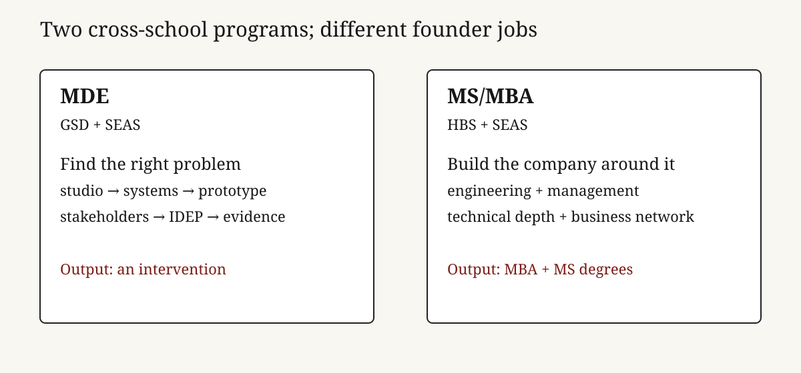

# Harvard’s hybrid master’s programs sell a designed career transition, not two labels

**Founder audience: builders choosing whether to acquire a technical, design, or business credential. Harvard’s MDE and MS/MBA: Engineering Sciences are both two-year, full-time joint degrees, but they solve different founder problems. MDE is a studio-led system for reframing and prototyping complex human problems across design and engineering; the MS/MBA is a dual-degree route for turning technical depth into a venture, product, or operating career through HBS and SEAS. The common trap is buying prestige before identifying the missing capability, the scarce peer network, and the decision you need the program to change.**

## TL;DR

- **MDE is a hybrid operating system for problem discovery and making.** It is jointly supported by the Graduate School of Design and SEAS, runs for two years/four terms, and combines design-engineering core work, studio, electives, and a second-year Independent Design Engineering Project (IDEP).[^1][^2]
- **MS/MBA is a dual credential and a business-building pathway.** It is a full-time two-year joint program with HBS and SEAS; graduates receive both the MBA and the MS in Engineering Sciences.[^3]
- **The choice is not “more interdisciplinary.”** MDE’s center of gravity is systems, design methods, stakeholder work, and prototypes. MS/MBA’s is technical innovation plus management formation and two separate degree signals. Neither substitutes for customer evidence or a cofounder.
- **The economic return must be modeled against opportunity cost.** Two years out of a compounding company can be irrational; two years inside a high-quality cohort can be rational when it gives a founder a technical language, a credible peer group, an institutional testbed, or a career reset they cannot cheaply create alone.

*Both programs cross schools, but the product and resulting credential differ. Source: Harvard program and registrar materials cited below.*

## The product is a two-year environment with two distinct jobs

MDE exists for people who need to work across disciplines before the problem is well formed. Harvard describes it as a collaborative degree between GSD and SEAS, using design and engineering to address consequential, complex challenges.[^1] The published curriculum is two years and four terms: first-year design-engineering studio and integrative frameworks, electives throughout, and an IDEP in the second year. The IDEP asks students, individually or in small groups, to work with stakeholders, build prototypes, and assess their impact.[^2]

That is closer to an institutionalized venture studio than an MBA with design electives. The public curriculum explicitly brings in economics, business, psychology, sociology, systems thinking, policy, intellectual property, ethics, and leadership, but it keeps the learning loop tied to a design-and-engineering project.[^2] Admissions expects a bachelor’s degree, technical literacy, a portfolio or project descriptions, and at least two years of professional experience; it is full-time and residential.[^4]

MS/MBA: Engineering Sciences is a different product. Harvard’s registrar describes a full-time, two-year joint program with SEAS and HBS that awards an MBA and an MS in Engineering Sciences on completion.[^3] The value is not merely that the schedule is compressed. It is the ability to acquire two institutional languages—management and engineering—plus access to the recruiting, faculty, and peer structures attached to each. For a founder, that can be a powerful bridge from technical insight to company formation. It can also be expensive signaling if the core gap is not management knowledge.

| Decision | MDE | MS/MBA: Engineering Sciences |
| --- | --- | --- |
| Primary job | Define, prototype, and assess a complex intervention | Combine technical innovation with business leadership and an MBA pathway |
| Institutional partners | GSD + SEAS | HBS + SEAS / GSAS |
| Published structure | Studio and frameworks in year one; IDEP in year two; flexible electives | Full-time two-year joint degree; MBA + MS credentials |
| Best founder use | Domain exploration, systems work, design/engineering fluency, prototyping | Venture formation, commercial leadership, technical-business credibility |
| Main risk | Beautiful exploration without a repeatable customer or distribution insight | Paying for two brands when a focused company apprenticeship would teach faster |

## MDE turns ambiguity into a structured learning loop

The sharpest MDE advantage is not “design thinking,” a phrase that can hide weak work. It is the imposed loop: investigate a system, form a point of view, build an intervention, put it in front of stakeholders, assess it, and iterate. The current curriculum calls this work understanding complex challenges, imagining solutions, building prototypes, and assessing them; first-year studio uses an annual domain and iterative projects, while the second-year IDEP makes the individual or small-group project the capstone.[^2]

For a founder entering climate, health, mobility, cities, industrial systems, or another domain with many constraints, that loop has real value. It expands the problem space before product choices harden. It can reveal who has authority, who pays, where a technical solution fails in use, and what data or policy limits adoption. Those are startup inputs, not academic decoration.

But MDE does not automatically solve commercial focus. A strong prototype can still lack a buyer, a budget, a distribution path, or a regulatory strategy. The founder must bring a market question into studio and force it through weekly contact with users. The test is not whether a project photographs well at review; it is whether a stakeholder commits time, data, a pilot, or money.

## MS/MBA turns a technical direction into a broader option set

The MS/MBA’s explicit output is broader: two degrees in two years.[^3] That matters in contexts where the MBA network and recruiting signal are decision-relevant, and where the engineering credential lets the graduate retain technical credibility. It can suit a technical founder who needs to learn pricing, organization design, financing, and go-to-market while remaining close to hard technology; it can also suit an operator moving into a technical company category.

The degree itself is not product-market fit. HBS can provide a dense network and a managerial curriculum; SEAS can supply technical coursework, research context, and engineers. A founder must still decide what scarce asset they are buying: a cofounder search surface, a customer-development environment, a recruiting option, deep technical learning, or a credible change in career narrative. If the answer is “a better chance at being a founder,” the investment thesis is too vague.

## The shared constraint is opportunity cost

These are full-time residential programs. MDE says students cannot work full-time during the immersive two-year course; MS/MBA is likewise full-time for its duration.[^3][^4] That makes the price more than tuition. It includes foregone salary, delayed company learning, and the chance that a market window closes. It also includes an option value: two years to build relationships, learn a new field, and test several directions before taking a bigger irreversible bet.

Use a simple scorecard before applying:

| Question | Evidence to collect | A good answer looks like |
| --- | --- | --- |
| What cannot I learn in my current role? | 20 conversations with target peers, customers, and alumni | A specific missing capability or network, not generalized ambition |
| Why now? | Market timing and personal runway | A domain transition or opportunity window that benefits from concentrated immersion |
| Which program creates the tighter feedback loop? | Project, course, and alumni examples | Regular contact with the users or operators you need to understand |
| What would make the degree a failure? | Pre-commitment metric | No pilot, no technical artifact, no new domain fluency, or no credible next role by graduation |

## Founder playbook

1. **Choose the bottleneck, then the degree.** Pick MDE if the constraint is disciplined problem framing and prototype-to-stakeholder learning; choose MS/MBA if the constraint is turning technical capability into a business and leadership option set. Test: write one sentence naming the missing asset and three program features that uniquely supply it.
2. **Arrive with a live field question.** Do not wait for a capstone prompt. Start interviews before enrollment and keep one market thesis running through studio, electives, and independent work. Test: earn a committed design partner, pilot, or proprietary data access by the end of year one.
3. **Convert coursework into external evidence.** A project is valuable only when a user, customer, regulator, or employer can act on it. Test: each term produces one artifact externally reviewed by a relevant decision-maker.
4. **Preserve the no-degree option.** Compare the program with two years of building, a targeted fellowship, and a role inside the desired category. Test: calculate the cash, learning, and network difference—not just admissions probability or brand.

The decision rule: **MDE is for founders who need a better way to find and make the right thing; MS/MBA is for founders who need to organize, finance, and lead the company around a technically grounded thing.** Either is a high-cost instrument. Use it only when the environment changes your learning curve more than two years of direct market contact would.

## Research notes and sources

[^1]: Harvard University, [Master in Design Engineering overview](https://www.harvard.edu/programs/master-in-design-engineering/). Primary source for the GSD–SEAS collaboration and program purpose.
[^2]: Harvard MDE, [curriculum](https://mde.harvard.edu/curriculum/). Primary source for the two-year/four-term structure, studio, frameworks, electives, and IDEP.
[^3]: Harvard GSAS Registrar, [MS/MBA: Engineering Sciences program description](https://registrar.fas.harvard.edu/resource/gsashandbookharvarduniversity-thegraduateschoolofartsandsciences-18-190pdf), and SEAS [graduate admissions page](https://seas.harvard.edu/prospective-students/prospective-graduate-students/how-apply). Primary sources for joint status, full-time duration, and the two degrees awarded.
[^4]: Harvard MDE, [application and FAQ](https://mde.harvard.edu/apply/). Primary source for admission expectations, residency, and full-time constraint. Program dates, tuition, and aid change; check the official sites before applying.

<footer>Compiled and checked August 27, 2026. This memo is an educational decision framework, not admissions advice. Tuition, deadlines, curriculum, and degree requirements may change.</footer>
