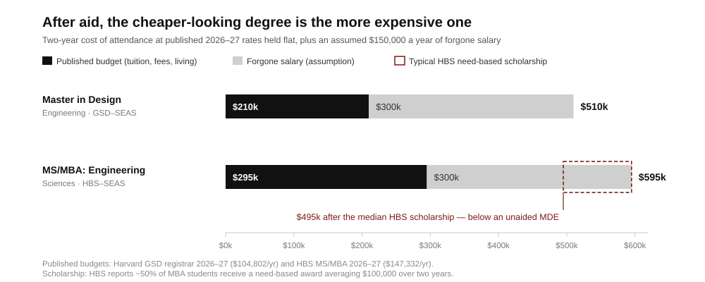

# Harvard’s hybrid master’s programs cost roughly half a million dollars, and tuition is the smaller half

**Founder audience: technical or design operators deciding whether to buy a two-year credential. Harvard runs two joint master’s programmes that founders confuse for each other. The Master in Design Engineering (MDE), first enrolling in fall 2016, is a GSD–SEAS studio degree built around problem framing and a second-year stakeholder project. MS/MBA: Engineering Sciences, first enrolling in August 2018, is an HBS–SEAS dual degree that admits about thirty people a year into a 900-person MBA class. Published budgets put MDE near $210,000 and MS/MBA near $295,000 over two years — but with HBS aid on one side and almost none on the other, the net gap narrows to nearly nothing, and both are dwarfed by the salary you do not earn. The decision is not which curriculum is better. It is whether two years of forced contact with a specific network changes your next five years by more than $500,000.**

## The position in five facts

- **Both are two full-time years, and neither permits a job.** MDE runs four terms with a required full-time residency; its own admissions page states that “working full time would not be possible.” MS/MBA runs four semesters plus summer and January coursework worth roughly three-quarters of an extra semester, which is why HBS bills it on a ten-month rather than nine-month year.[^1][^2][^3]
- **The sticker gap is $85,000; the net gap is far smaller.** HBS publishes a 2026–27 MS/MBA budget of $147,332 (tuition $97,474) against a standard MBA budget of $130,318. Harvard GSD publishes a 2026–27 master’s budget of $104,802 (tuition $64,000), up from $99,864. But about 50% of HBS MBA students receive need-based scholarships averaging $100,000 over two years, with 10% on full tuition and $47 million awarded in FY25. MDE’s published aid is two $15,000 merit scholarships annually, up to five directors’ awards, and a need-based fellowship for the third semester.[^2][^3][^4][^5]
- **Forgone salary is the largest line item in both budgets and neither school prints it.** For a candidate with the required two-plus years of engineering or design experience, two years out at $150,000 is $300,000 — more than either tuition bill.
- **The programmes disclose different things, and the difference is the finding.** HBS published a Class of 2025 median base salary of $184,500, with 90% of job-seekers holding an offer three months out; MDE publishes destination shares for its 2018–2021 cohorts — 26% joined or launched startups within three years, 21% became product managers or designers, 17% researchers or strategists — and no salary distribution. A priced labour market for the credential exists in one case and not the other.[^6][^7]
- **The base rate is worse than the brand suggests.** Across roughly 14,000 US graduate programmes, about 40% of master’s degrees and 39% of MBAs return zero or negative lifetime financial value. Elite programmes sit in the positive tail, but the burden of proof belongs to the specific programme, not the university.[^8]

## What each programme actually sells

MDE sells an imposed loop. First year is design-engineering studio and integrative frameworks on an annual domain; second year is the Independent Design Engineering Project, in which a student or small group works with real stakeholders, builds prototypes and assesses impact.[^1] The curriculum reaches into economics, policy, psychology, IP and ethics, but the learning always terminates in a made thing put in front of someone who did not commission it. Admission expects a bachelor’s, technical literacy in calculus, statistics or code, a portfolio, and at least two years of professional experience.[^2]

That is closer to a funded research residency than to a business school. Its scarce inputs are studio time, fabrication access, a joint GSD–SEAS faculty committee, and a two-year excuse to knock on doors as a Harvard student rather than a vendor. Its failure mode is legible from the outside: a beautifully documented intervention with no buyer, no budget line and no distribution path. Nothing in the structure forces a market question, so the student must import one.

MS/MBA sells network position and optionality. Roughly thirty students a year join a cohort inside HBS, take the MBA core plus cohort-exclusive courses and a Tech Venture Immersion split between engineering prototyping and commercialization, and graduate with both an MBA and an MS in Engineering Sciences.[^9][^10] The alumni base is above 200; SEAS reports five to seven ventures founded by alumni each year and more than $300 million raised collectively, and features Blitzy and Nominal as billion-dollar outcomes — all school-reported and unaudited.[^9]

The honest read of those outcomes is that five to seven ventures a year from a thirty-person cohort is a founding rate somewhere near 20%, which is close to MDE’s 26% who “joined or launched” a startup within three years — a weaker measure, since it counts joining. Neither figure has a control group, and both programmes admit people who were already going to start companies. **Treat published founding rates as evidence about admissions, not about the curriculum.**

## Price the two years, not the tuition

*Published budgets held flat at the 2026–27 rate for a second year; forgone salary assumes $150,000 a year, the author’s assumption, not a school figure. The aid bar applies to the roughly half of HBS students who receive a need-based scholarship; MDE’s published awards reach a much smaller share of its cohort. Sources: Harvard GSD registrar, HBS cost of attendance and financial aid pages.*

Run the arithmetic and the conventional ranking inverts. At the published 2026–27 rates held flat, MDE is about $210,000 over two years and MS/MBA about $295,000. Add $300,000 in forgone salary and MDE lands near $510,000, MS/MBA near $595,000. Now apply aid: the median HBS scholarship recipient takes $100,000 off, landing near $495,000 — below an unaided MDE.[^3][^4][^5]

Two conclusions follow. First, **the cheaper-looking programme can be the more expensive one**, because aid depth, not list price, determines what a given admit pays; ask each programme for the share of its cohort receiving aid and the median award before comparing anything. Second, tuition differences of $85,000 are 15% of a $550,000 decision. Anyone choosing between these on price is optimizing the smallest term while the largest term — two years of compounding somewhere else — goes unpriced.

The right comparator is therefore not the other Harvard programme. For MS/MBA it is two years running a funded company or holding a senior role at a company in your target category; for MDE it is a funded research fellowship, a residency, or two years inside a design consultancy serving the domain you want to enter. Both alternatives supply project work and colleagues. Neither supplies the specific thing a degree supplies, which is a scheduled, high-density introduction to several hundred people who will still take your call in 2036.

## What the disclosure asymmetry tells a buyer

HBS reports outcomes like a market: 929 graduates in the Class of 2025, 65% seeking post-MBA employment, 90% of those with an offer within three months, 84% accepted, median base salary $184,500.[^6] MDE reports outcomes like a portfolio: destination categories and employer names — Spotify, Amazon, IDEO, Deloitte, the US Department of Defense — for cohorts that graduated between 2018 and 2021, with no salary distribution and no job-seeking denominator.[^7]

This is not a reporting failure. Employers bid against each other for the MBA credential in a repeated, priced market, so a median is meaningful and publishing it is competitive. There is no comparable bidding market for “design engineer, Harvard MDE,” so a median would be noise and destinations are the honest disclosure. The buyer’s inference is direct: **a programme that cannot publish a salary distribution is telling you the credential has no clearing price.** That is fine if you are buying capability, method and a project. It is disqualifying if you are buying placement.

Note also that only 65% of the HBS class sought post-MBA employment.[^6] The most-cited placement statistic in graduate education describes two-thirds of a class; the other third — founders, sponsored returnees, continuing students — is where a founder audience actually sits, and its outcomes are not in the report.

## The 2026 risks that are not in the brochure

Two live constraints deserve pricing this cycle. A new federal rule replaces duration-of-status with a fixed four-year admission for F and J visas effective September 15, 2026, and Harvard advised international students to be in the country before that date; the university enrols roughly 6,800 international students.[^11] A two-year programme fits inside four years, so the direct risk is low, but travel and re-entry during the programme are now a live variable for anyone not on a US passport — including the field research and stakeholder work MDE is built around.

The second is timing risk on the thesis itself. Both programmes require two-plus years of prior experience and take two years to complete, so the earliest a decision made this autumn produces a company is 2029. If your advantage is a market window, that window is the cost. If your advantage is a durable technical capability or a category you intend to work in for a decade, two years is cheap.

## Founder playbook

| Phase | Action | Test |
| --- | --- | --- |
| Before applying | Write one sentence naming the asset you cannot buy any other way, and three programme features that uniquely supply it. | If the sentence survives substituting “a fellowship” or “a senior role at a target company,” do not apply. |
| Comparing offers | Compare net two-year cost after aid plus forgone salary, not tuition. | Ask each programme for the share of the cohort receiving aid and the median award; refuse to compare list prices. |
| During year one | Import a live market question and keep it running through studio, electives and independent work. | A committed design partner, pilot, proprietary data set or letter of intent by the end of year one. |
| Every term | Convert coursework into artefacts an outsider can act on. | One artefact per term reviewed by a decision-maker who does not work for Harvard. |
| Pre-commitment | Define failure before you enrol. | Written now: no pilot, no technical artefact, no new domain fluency, no credible next role by graduation equals a failed $500,000 purchase. |

The decision rule: **MDE if the binding constraint is finding and making the right thing; MS/MBA if it is financing, staffing and leading a thing you have already found.** Both are correctly priced only when compared against two years of direct market contact, and both are worth it only when the environment changes your learning curve faster than customers would.

## Research notes and sources

[^1]: Harvard MDE, [curriculum](https://mde.harvard.edu/curriculum/). Primary source for the two-year, four-term structure, first-year studio and integrative frameworks, electives, and the second-year Independent Design Engineering Project.
[^2]: Harvard MDE, [how to apply](https://mde.harvard.edu/apply/). Primary source for full-time residency, the two-years-experience and portfolio expectations, the statement that working full time is not possible, and the published aid: two $15,000 merit scholarships annually, up to five Program Directors’ Awards, and a need-based third-semester fellowship. The programme does not publish cohort size; first-cohort enrolment in fall 2016 is described in Harvard’s launch coverage.[^12]
[^3]: Harvard Graduate School of Design, [tuition and the academic year budget](https://www.gsd.harvard.edu/offices-and-facilities/office-of-the-registrar/tuition/). Primary source for the 2025–26 master’s budget of $99,864 (tuition $61,510) and the 2026–27 budget of $104,802 (tuition $64,000). MDE is not itemized separately and follows the standard master’s budget. Two-year totals in this memo hold the 2026–27 rate flat and are labelled estimates.
[^4]: Harvard Business School, [annual cost of attendance](https://www.hbs.edu/mba/financial-aid/tuition-assistance/cost-of-attendance), 2026–27. Primary source for the MS/MBA ten-month single-student budget of $147,332 (tuition $97,474) and the nine-month MBA budget of $130,318 (tuition $84,760).
[^5]: Harvard Business School, [financial aid](https://www.hbs.edu/mba/financial-aid/Pages/default.aspx). Primary source for approximately 50% of MBA students receiving need-based scholarships, a $100,000 average award over two years, 10% receiving full tuition, and $47 million awarded in FY25. HBS does not break these figures out for joint-degree students, so their application to MS/MBA is an inference and should be confirmed with the school.
[^6]: Harvard Business School MBA Class of 2025 employment report, as reported by [Poets&Quants](https://poetsandquants.com/2025/12/02/harvard-business-school-class-of-2025-jobs-report-offers-rebound-pay-soars/) and [Clear Admit](https://www.clearadmit.com/2025/12/hbs-mba-class-of-2025-employment-report/), Dec. 2025. Secondary reporting of a school-published report: 929 graduates, 65% seeking post-MBA employment, 90% with an offer within three months, 84% accepted, median base salary $184,500.
[^7]: Harvard MDE, [programme site](https://mde.harvard.edu/). Primary source for the 2018–2021 cohort outcomes: 26% joined or launched startups within three years, 21% product managers or designers, 17% researchers or strategists, with named employers. Self-reported destination shares covering cohorts now five to eight years out; no salary data, denominators or response rate are published.
[^8]: Preston Cooper, [*Is Grad School Worth It? A Comprehensive Return on Investment Analysis*](https://freopp.org/whitepapers/is-grad-school-worth-it-a-comprehensive-return-on-investment-analysis/), FREOPP. Source for roughly 40% of master’s programmes and 39% of MBA programmes returning zero or negative lifetime value across approximately 14,000 graduate programmes. Uses federal earnings data with modelled counterfactuals; program-level results for selective institutions are generally strongly positive.
[^9]: Harvard SEAS, [MS/MBA: Engineering Sciences](https://seas.harvard.edu/msmba). Primary source for the joint degree structure, the two-phase Tech Venture Immersion, the 200-plus alumni base, five to seven ventures founded annually and $300 million-plus raised, and the Blitzy and Nominal examples. Venture and valuation figures are school-reported and unaudited.
[^10]: Harvard Business School, [MS/MBA: Engineering Sciences](https://www.hbs.edu/mba/academic-experience/joint-degree-programs/ms-mba-engineering-sciences). Primary source for the target of about thirty students annually and the four-semester structure plus summer and January coursework.
[^11]: The Harvard Crimson, [Harvard International Office advises students to be in the US by Sept. 15](https://www.thecrimson.com/article/2026/8/21/hio-students-visa-rule/), Aug. 2026, and Harvard Magazine, [international students capped at four years](https://www.harvardmagazine.com/students/harvard-new-international-student-visa-rule). Reporting on the replacement of duration-of-status with a fixed four-year admission for F and J visas and Harvard’s roughly 6,800 international students. Rules and litigation were in flux at publication; verify before relying on this.
[^12]: Harvard SEAS, [launch of the Master in Design Engineering](https://www.seas.harvard.edu/news/2015/09/harvard-launches-masters-in-design-engineering-program), 2015, and Harvard Magazine, [Harvard launches design engineering degree](https://www.harvardmagazine.com/harvard-graduate-school-of-design/harvard-launches-design-engineering). Primary and press sources for the programme’s announcement and its first enrolment in fall 2016.

<footer>Compiled and checked August 27, 2026. An educational decision framework, not admissions advice. Two-year totals hold published 2026–27 rates flat and add an assumed $150,000 annual forgone salary; tuition, aid, curriculum and immigration rules change, so verify current figures with each school before deciding.</footer>
