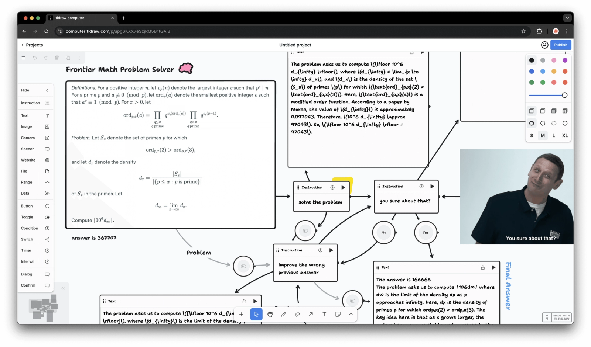
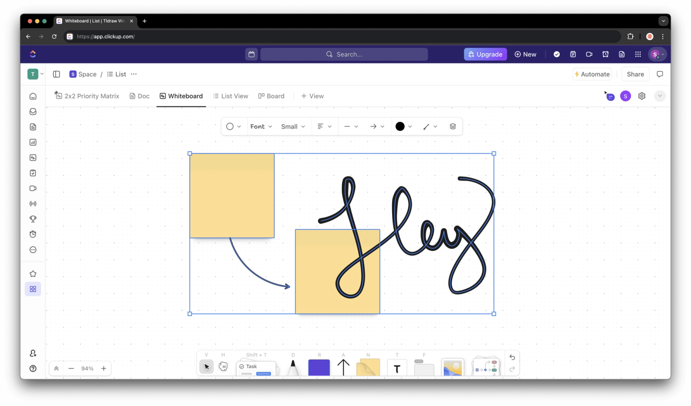
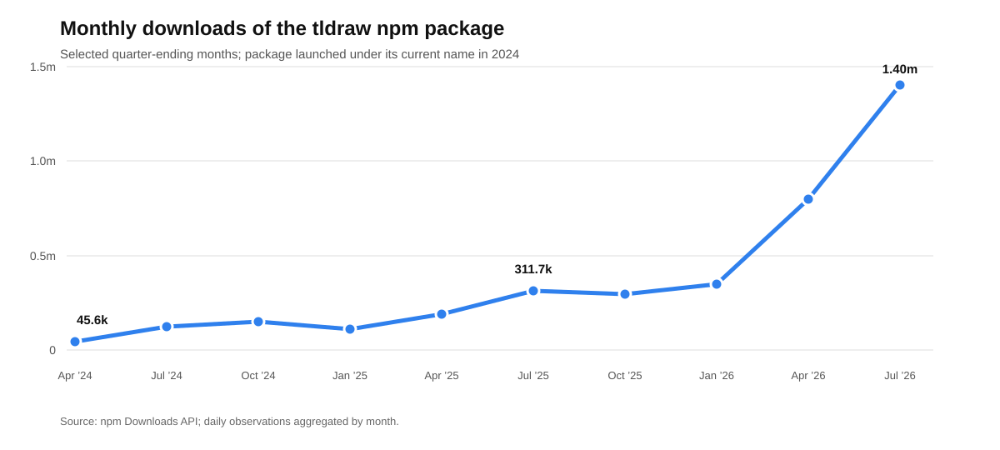

# tldraw: open source found the market; licensing must prove the business

**tldraw used permissive open source to turn a side project into the canvas engine inside products such as ClickUp Whiteboards and Padlet Sandbox. That distribution created trust, product insight, and an installed base—but no automatic revenue, because customers run the SDK on their own infrastructure. tldraw responded by charging for production rights. The legal change arrived in 2023; customers felt it when license keys began enforcing the terms in 2025. Developer adoption has since accelerated. The unanswered question is whether annual enterprise licenses renew and expand fast enough to support a venture-backed specialist team.**

## The position in five facts

- **Customers buy years of engineering.** tldraw says the canvas required three years and $5 million to build. ClickUp used it to replace legacy whiteboard infrastructure; Padlet launched an education canvas in ten weeks.
- **Open source created the company.** MIT distribution helped a solo project become a developer primitive, taught the team that the market extended beyond whiteboards, and supplied the usage evidence behind its first funding rounds.
- **The artifact contains the value.** Production customers self-host the browser SDK and tldraw sync. tldraw receives no cloud usage margin, end-user seat revenue, or data toll from a commercial deployment.
- **The company has moved upmarket.** A $6,000-per-team annual price was reported around SDK 4.0 in 2025. The current page publishes no number, offers value-based annual pricing, and sends buyers to sales. Startup discounts are discretionary.
- **Traction exceeds disclosure.** tldraw has raised $14.7 million and disclosed just under $1 million of license revenue in its first selling year. By August 2026 it had about 50,000 GitHub stars and 388,000 weekly npm downloads, yet current ARR, customer count, retention, and renewal remain private.

## tldraw sells the physics of a canvas

tldraw.com looks like a whiteboard. The commercial product is the TypeScript and React SDK beneath it: camera, selection, drawing, geometry, snapping, text, clipboard, history, export, persistence, accessibility, presence, and multiplayer synchronization. Customers add their own objects, data, workflows, and interface.

This distinction expands the market. A whiteboard is a finished application. A canvas engine can sit inside project management, education, bug reporting, CAD review, data labeling, visual programming, or an agent workspace. Its shapes are React components in the DOM, so the surface can hold live tasks, websites, videos, model outputs, and custom business objects.

The technical burden is easy to underestimate. A rotated cursor, pasted image, two-finger gesture, or arrow attached to a moving object creates interactions across geometry, input, history, rendering, and collaboration. The accumulated edge cases are the product. The free whiteboard is therefore a showroom and a test harness: every bug it exposes improves the SDK another company can embed.

*tldraw computer, built with Google DeepMind, illustrates the larger product thesis: people, models, and live artifacts sharing one programmable surface. Source: tldraw’s April 2025 Series A announcement.*

## Customers buy speed, reliability, and a missed deadline avoided

There are four buying motions: replace legacy infrastructure, catch a time-sensitive market opening, upgrade one difficult feature, or make a bespoke internal tool economical. ClickUp and Padlet show the first two at meaningful scale.

**ClickUp replaced a mature surface.** Its Whiteboards product served a platform with more than ten million users, but the legacy canvas accumulated interaction bugs and slowed new development. tldraw supplied frames, hotkeys, context menus, input behavior, and geometry. ClickUp retained the surrounding product, restyled the interface, and added shapes containing live tasks and documents. The purchase removed infrastructure risk while preserving differentiation.

*ClickUp owns the workflow, data, and visual language; tldraw supplies the interaction engine. Source: tldraw’s ClickUp case study and Series A announcement.*

**Padlet caught the Jamboard window.** When Google began phasing out Jamboard, Padlet had an opening to build an education-specific canvas. It bridged tldraw into a Vue application, converted existing Padlet blocks into shapes, constrained the camera for classrooms, and added pages and presentation controls. Sandbox launched after ten weeks. Padlet later reported 400,000 monthly users, 140,000 new Sandboxes per month, and Sandbox accounting for more than 10% of new Padlets. These are company-published figures rather than audited results, but they show the economic claim: buying the engine made the market window reachable.

The smaller cases show how far the same logic travels. One Jam developer built the core screenshot-annotation prototype in 24 hours and shipped it six weeks later. Three Mobbin engineers built two internal visual tools in less than three months. The unit of value across all four cases is engineering time, product risk, and speed to a quality bar.

## Open source created the market—and the trap

In 2021, Steve Ruiz needed learning and distribution more than control. An MIT license let developers inspect the work, embed it without procurement, and stretch the canvas into notes, maps, story worlds, spreadsheets, websites, and application controls. Those experiments revealed the category: a general substrate for spatial software.

The community then became financing evidence. A $2.7 million seed in 2022 funded a ground-up rewrite; a $2 million extension followed in 2023. Make Real went viral that November by turning rough sketches into working websites. When the rushed experiment asked users to provide an OpenAI API key, public code made the behavior inspectable and remixable. Openness was doing four jobs at once: distribution, diligence, product research, and fundraising proof.

Success exposed the trap. The customer downloaded the valuable artifact and ran it inside its own product. Every additional commercial user increased maintenance expectations without creating hosting revenue. A front-end component has no natural meter unless its maker deliberately creates one.

tldraw considered three:

| Model | Economic engine | tldraw’s decision |
| --- | --- | --- |
| Hosted collaboration | Charge for documents, storage, connections, or managed operations. | tldraw sync is included, but production customers host it themselves. |
| Premium product layers | Keep a permissive core and sell advanced modules. | Premium modules are still described as “in development”; there is no public paid catalog. |
| Commercial production rights | Let teams develop freely, then charge for permission to deploy. | This became the revenue engine. Current contracts are annual and value-based. |

## The legal change came first; enforcement made it real

In December 2023, the v2 beta replaced permissive licensing with terms adapted from Scratch. Development and non-commercial use remained available; commercial production required another agreement. Prior MIT and Apache releases kept their original rights. The source stayed public, while the current SDK became source available.

For the next 21 months, the code still ran in production. The contract had changed, but the product behavior had not. SDK 4.0 closed that gap in September 2025 with client-validated license keys, a 100-day trial, and hobby licenses with attribution. Production now requires an active key. **The legal change happened first. The felt change came when the code began checking.** That delay explains much of the backlash: developers experienced a new constraint long after tldraw considered it settled.

The response is coherent with the company tldraw chose to build. Hosting production sync for large customers would create another operating system inside the company: uptime obligations, incident response, security reviews, data residency, storage economics, and enterprise compliance. Self-hosting leaves that revenue on the table, but it lets a 19-person team concentrate on canvas interaction. Focus is the strategic benefit; dependence on one license line is the cost.

The pricing evolution makes the target customer clear. Public reporting around the 2025 launch cited $6,000 per team per year. The current pricing page uses “value-based pricing,” advertises startup discounts, and requires a sales conversation. This is an upmarket move: tldraw can price against ClickUp-scale avoided engineering, while an early startup loses budget certainty at the moment its prototype becomes a product.

Tiptap shows the alternative. Its editor core remains MIT; its 2025 model charges by cloud document for collaboration, history, comments, and higher-value bundles. It even open-sourced former Pro extensions once they stopped driving the business. Tiptap accepts the complexity of a platform and hosting organization in exchange for a usage-linked expansion path. tldraw accepts a narrower organization in exchange for monetizing the core directly.

That choice creates a specific renewal question. Annual keys create a renewal event, and the license restricts production use outside the key’s term. They do not establish continuing willingness to pay. Once a canvas integration is stable, a buyer may feel that the implementation work has already been purchased. tldraw must make each new year valuable through upgrades, support, accessibility, browser compatibility, sync improvements, and new modules—or rely increasingly on enforcement and switching cost. Renewal and expansion are therefore more important than gross new-logo count.

The open substitute sets a ceiling on friction. Excalidraw remains MIT and has roughly 130,600 GitHub stars and 513,600 weekly npm downloads. It is a lighter, app-first product, so the figures do not imply feature equivalence. They do prove that a large permissive ecosystem can capture projects whose founders prize durable rights and predictable cost.

## Adoption survived the change; business quality remains undisclosed

| Date | Commercial or operating signal |
| --- | --- |
| Nov. 2022 | $2.7M seed |
| Nov. 2023 | $2.0M seed extension |
| Apr. 2025 | $10.0M Series A; just under $1.0M of first-year license revenue |
| Sep. 2025 | 40,000 GitHub stars; more than 70,000 weekly npm downloads; 100-day production trial introduced with enforced keys |
| Aug. 2026 | 49,974 GitHub stars; 388,207 weekly npm downloads; 19 employees listed |

*Monthly package downloads rose from 45,602 in April 2024 to 1,401,419 in July 2026. Downloads include CI and repeat retrievals; they measure developer activity, not active users or revenue. Source: npm Downloads API.*

The feared top-of-funnel collapse did not occur. Weekly downloads grew more than 5.5 times after SDK 4.0, GitHub stars increased about 25%, and headcount stayed roughly flat. That combination suggests real operating leverage: far more distribution and product usage without a larger listed team.

It cannot answer the business question. Downloads can increase while paid conversion or renewal weakens. The first-year revenue disclosure proved willingness to pay; the absence of later ARR, retention, and customer-count data prevents a judgment on durability.

## AI enlarges the opportunity and lowers the cost of alternatives

AI creates demand for a surface that can hold parallel outputs, branches, relationships, and precise visual feedback. tldraw has built toward this market through Make Real, tldraw computer, agent and workflow starter kits, an MCP app inside Cursor and Claude, scriptable offline files, and canvas comments that let people or agents point to a specific object.

The same tools compress build-versus-buy. Coding agents can scaffold custom shapes, translate examples, explain an unfamiliar fork, and compose lower-level open libraries. tldraw is responding with LLM-readable documentation and starter kits, turning models into a distribution channel. Its durable edge must come from maintained interaction quality, multiplayer correctness, accessibility, migrations, and cross-device testing—the long tail that generated the $5 million build cost.

Three outcomes remain plausible:

- **Focused infrastructure business:** annual enterprise SDK licenses renew because tldraw remains cheaper and safer than maintaining a canvas team.
- **Agent-interface platform:** comments, sync, workflows, and agent modules expand the paid surface as canvases become a standard human-model workspace.
- **Healthy usage, weak capture:** downloads keep climbing while early projects choose permissive components and mature customers resist recurring payments for a stable integration.

The decisive metrics are paid conversion after the trial, renewal and expansion, revenue from modules, and production adoption of agent workflows. Viral demos and package downloads are leading indicators; they are not the result.

## What founders should do at each phase

| Phase | Action | Test or metric | What tldraw teaches |
| --- | --- | --- | --- |
| Before product-market fit | Write down the jobs open source must perform: distribution, trust, integrations, edge-case discovery, or hiring. Choose a permissive license only when those jobs matter. | Review the first 20 serious downstream projects and record what each teaches about the category. | Unexpected canvas uses revealed a broader SDK market before tldraw had a sales motion. |
| When adoption appears | Map where money, data, and operational work flow around the artifact. Identify the buyer and the event that should trigger payment. | Conduct ten build-versus-buy interviews; quantify avoided engineers, time, risk, and ongoing work. | Commercial users embedded the whole product and self-hosted it, leaving no automatic tollbooth. |
| Before scaling payroll | Test all three models—hosting, premium layers, and commercial rights—with actual offers. Pick the organization each model requires, not just the revenue line it promises. | Close several paid design partners and learn purchase trigger, contract size, implementation cost, and likely renewal reason. | tldraw chose focus over hosted margin; Tiptap chose a larger platform with usage-linked expansion. |
| Before changing the license | Publish the rights, grandfather policy, trial, small-company path, pricing logic, and enforcement date together. Model which contributors and downstream projects lose rights. | Track migrations, abandoned trials, support objections, and new-project starts by company size. | tldraw changed the contract in 2023 and enforcement in 2025; the 21-month gap made the second date feel like the real closure. |
| After monetization | Manage two funnels separately: experimentation and commercial conversion. Keep examples and starter kits easy to discover while measuring whether production teams renew. | Dashboard trial-to-paid conversion, gross and net retention, module attach, community-created projects, and open-alternative losses. | Downloads accelerated after enforcement, while private renewal data leaves the business outcome unresolved. |

The practical rule is simple: **use open source to buy learning and distribution when those assets are scarce. Design the tollbooth before the cost base assumes one exists. Charge where the customer already receives durable value. If the bargain changes, make the legal terms, product behavior, and communication change at the same time. Then protect the experimental surface that can still reveal the next market.**

## Sources and research notes

1. tldraw, [seed announcement](https://tldraw.dev/blog/announcing-tldraws-seed-round), Nov. 2022; [seed extension](https://tldraw.dev/blog/tldraw-raised-another-2m), Nov. 2023; and [Series A](https://tldraw.dev/blog/announcing-tldraw-series-a), Apr. 2025. Primary sources for origin, funding, first-year license revenue, team size, build cost, and product strategy.
2. tldraw, [Make Real: the story so far](https://tldraw.dev/blog/make-real-the-story-so-far), Nov. 2023. Primary source for the prototype, API-key episode, remix loop, and response.
3. tldraw, [License update](https://tldraw.dev/blog/license-update-for-the-tldraw-sdk), Dec. 2023; [SDK 4.0](https://tldraw.dev/blog/tldraw-sdk-4-0), Sep. 2025; [current pricing](https://tldraw.dev/pricing); [license documentation](https://tldraw.dev/community/license); and [repository license](https://github.com/tldraw/tldraw/blob/main/LICENSE.md). Primary sources for the licensing sequence, enforcement, trial, current value-based pricing, and production restrictions.
4. tldraw, [sync announcement](https://tldraw.dev/blog/announcing-tldraw-sync) and [deployment documentation](https://tldraw.dev/docs/sync). Primary sources for the included collaboration layer, hosted demo, and customer-run production architecture. The organizational consequences of hosting are the memo’s inference.
5. tldraw customer studies: [ClickUp](https://tldraw.dev/blog/clickup), [Padlet](https://tldraw.dev/blog/padlet), [Jam](https://tldraw.dev/blog/jam), and [Mobbin](https://tldraw.dev/blog/mobbin). Customer and vendor claims; the reported outcomes have not been independently audited.
6. tldraw, [AI integration documentation](https://tldraw.dev/docs/ai), [MCP app](https://tldraw.dev/blog/tldraw-mcp-app), [offline product](https://tldraw.dev/blog/tldraw-offline), [LLM documentation](https://tldraw.dev/docs/llm-docs), and [Agents can’t point](https://tldraw.dev/blog/agents-cant-point). Primary sources for the AI product sequence and agent-interface thesis.
7. GitHub API, [tldraw repository](https://api.github.com/repos/tldraw/tldraw), and npm Downloads API for [2024](https://api.npmjs.org/downloads/range/2024-01-01:2024-12-31/tldraw), [2025](https://api.npmjs.org/downloads/range/2025-01-01:2025-12-31/tldraw), [2026](https://api.npmjs.org/downloads/range/2026-01-01:2026-08-25/tldraw), and the [latest week](https://api.npmjs.org/downloads/point/last-week/tldraw). Daily downloads were aggregated by calendar month.
8. Excalidraw, [GitHub repository](https://github.com/excalidraw/excalidraw), [repository API](https://api.github.com/repos/excalidraw/excalidraw), and npm [latest-week downloads](https://api.npmjs.org/downloads/point/last-week/%40excalidraw%2Fexcalidraw). Current permissive comparator.
9. Tiptap, [2025 pricing model](https://tiptap.dev/blog/release-notes/tiptaps-new-pricing-model-is-live), [open-sourcing former Pro extensions](https://tiptap.dev/blog/release-notes/were-open-sourcing-more-of-tiptap), and [current pricing](https://tiptap.dev/pricing). Primary sources for the MIT-core, paid-platform comparator.
10. BigGo, [report on the SDK 4.0 pricing debate](https://biggo.com/news/202509190115_tldraw_SDK_4.0_Licensing_Debate), Sep. 2025. Secondary source for the then-reported $6,000 annual team price and community concerns; current pricing is taken from tldraw directly.

*Compiled and checked August 27, 2026. Company revenue, customer count, retention, and valuation remain private unless explicitly disclosed above.*
